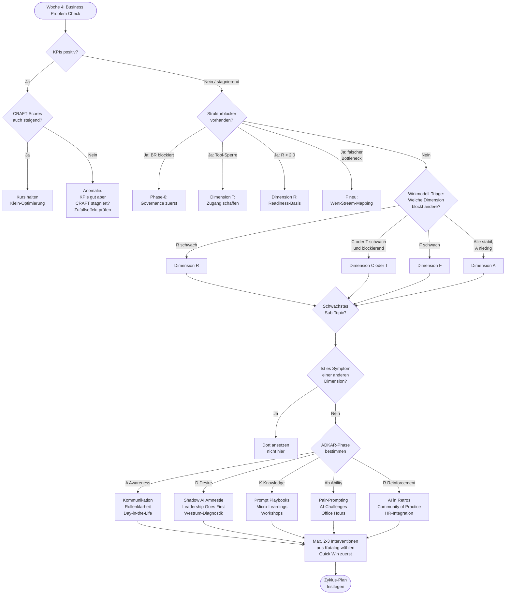

# CRAFT Zyklus-Entscheidungs-Guide
## Woran arbeiten wir im nächsten Zyklus?

**Version:** 1.0 DRAFT
**Erstellt:** 2026-04-28
**Verantwortlich:** AI Transformation Manager
**Eingesetzt in:** Woche 4 jedes 4-Wochen-Zyklus (Business Problem Check + Readiness Gate)

---

## 1. Zweck dieses Guides

Das Readiness Gate (Framework Kap. 4) beantwortet die Makro-Frage: *Erweitern, Vertiefen oder Konsolidieren?* Es beantwortet nicht die operative Folgefrage:

> **"Gut — aber an welcher Dimension, welchem Sub-Topic und welcher konkreten Intervention arbeiten wir jetzt?"**

Diese Lücke ist in der Praxis die häufigste Ursache für schlechte Investitionsentscheidungen:

- Teams arbeiten an der sichtbarsten Schwäche statt der wirkungsvollsten
- Symptome werden adressiert statt Ursachen
- Interventionen werden gewählt weil sie leicht sind, nicht weil sie passen
- CRAFT-Scores verbessern sich, Business-KPIs bewegen sich nicht

Dieser Guide schließt diese Lücke mit einem strukturierten, dreischichtigen Entscheidungsprozess.

---

## 2. Wann wird dieser Guide eingesetzt?

**Pflicht:** Woche 4 jedes Zyklus, nach Business Problem Check, vor der Readiness Gate Entscheidung.

**Optional:** Wenn der AI Transformation Manager zwischen zwei Zyklen eine Kurskorrektur erwägt (z.B. nach einem kritischen Incident, Teamwechsel, oder Kundenfeedback).

**Voraussetzungen:**
- Aktueller Pulse Check (max. 4 Wochen alt)
- Business-Impact-Kennzahlen: Delta seit letztem Zyklus
- Diagnostik-Antworten aus dem Pulse Check (MC-BLOCKER, MC-ENABLEMENT)
- Context Explorer Ergebnisse (einmalig, vom Kickoff)

---

## 3. Die drei Entscheidungsschichten

```
┌─────────────────────────────────────────────────────────────┐
│  Schicht 1: STRUKTURELLE BLOCKER                            │
│  Gibt es etwas, das alle Interventionen unterlaufen würde?  │
│  → Erst beheben, dann weiter                                │
└─────────────────────────────┬───────────────────────────────┘
                              │ Kein Blocker
                              ▼
┌─────────────────────────────────────────────────────────────┐
│  Schicht 2: DIMENSION                                       │
│  Welche CRAFT-Dimension hat aktuell den größten Hebel?      │
│  → Wirkmodell-Triage: R → C/T → F → A                      │
└─────────────────────────────┬───────────────────────────────┘
                              │ Dimension gewählt
                              ▼
┌─────────────────────────────────────────────────────────────┐
│  Schicht 3: SUB-TOPIC & INTERVENTION                        │
│  Wo in der Dimension ansetzen? Womit?                       │
│  → Min-Regel + ADKAR-Phase + Diagnostik                     │
└─────────────────────────────────────────────────────────────┘
```

**Wichtige Grundregel:** Die Schichten werden immer in dieser Reihenfolge durchlaufen. Eine starke Intervention in der falschen Schicht verpufft — oder schlimmer, sie verdeckt den eigentlichen Blocker.

---

## 4. Schicht 1: Strukturelle Blocker

Strukturelle Blocker sind Bedingungen, die **außerhalb der ADKAR-Logik** wirken. Sie blockieren nicht eine ADKAR-Phase — sie machen alle ADKAR-Phasen gleichzeitig unwirksam. Kein Skill-Training hilft, wenn die Tools gesperrt sind. Keine Adoption-Kampagne hilft, wenn der Betriebsrat blockiert.

| Signal | Herkunft | Konsequenz für nächsten Zyklus |
|---|---|---|
| `ctx_works_council = blocking` | Context Explorer | **Governance Phase-0:** BR-Einbindung als alleinige Priorität. Alle anderen Interventionen warten. |
| `rdy_api_access = blocked` + R-Interventionen geplant | Context Explorer | **Dimension T zuerst:** Tool-Zugang schaffen, bevor Readiness-Arbeit starten. |
| R-Score < 2.0 | Pulse Check | **Dimension R als Voraussetzung:** F und A können nicht skalieren ohne Readiness-Basis. |
| Business-KPIs sinken **trotz** steigender CRAFT-Scores | Business Problem Check | **F überprüfen:** Das Value Stream Mapping adressiert möglicherweise den falschen Bottleneck. Neues VSM vor Interventionen. |
| Teamwechsel >30% seit letztem Zyklus | Wahrnehmung/HR | **Konsolidieren + R:** Neues Onboarding nötig, Adoption-Gains sind gefährdet. |

**Entscheidungsregel:** Liegt einer dieser Blocker vor → sofort benennen, als primäre Maßnahme einplanen, Rest des Guides überspringen bis behoben.

---

## 5. Schicht 2: Dimension

### 5.1 Das Wirkmodell als Triage

Das CRAFT-Wirkmodell (Framework Kap. 5.4) definiert eine kausale Priorität:

```
R (Voraussetzung)
    ↓
C + T (Freischalter)
    ↓
F + A (Value Driver) ← hier entsteht messbarer Business Impact
```

Das bedeutet: Wenn mehrere Dimensionen gleichzeitig schwach sind, gibt es eine natürliche Reihenfolge. **Nicht die Dimension mit dem niedrigsten Score wählen — die Dimension wählen, die aktuell andere blockiert.**

### 5.2 Dimensions-Auswahl: Entscheidungsmatrix

| Situation | Empfohlene Dimension | Begründung |
|---|---|---|
| R-Score niedrig + A-Score niedrig | **R** | Adoption kann nicht steigen, wenn Readiness fehlt — mehr A-Intervention ist verschwendet |
| T gesperrt + R motiviert | **T** | Motivierte Teams ohne Tools frustrieren sich — Motivation kippt in Resignation |
| C unklar + A niedrig | **C** | Ohne klare Policies bleibt Adoption Shadow AI — offizielle Nutzung kann nicht skalieren |
| F niedrig + A hoch | **F** | Tools werden genutzt, aber am falschen Ort. VSM zeigt wohin. |
| A niedrig + alle anderen stabil | **A** | Erst jetzt ist A der richtige Hebel |
| Alle Scores ähnlich (Δ < 0.5) | **F oder A** | Hier entsteht Business Impact. Lieber F/A optimieren als R weiter polieren. |

### 5.3 Relatives vs. absolutes Scoring

Nicht nur absolute Scores betrachten — die **relative Position** ist oft aussagekräftiger:

| Muster | Interpretation |
|---|---|
| R niedrig, T hoch | Tools sind da, Menschen können/wollen sie nicht nutzen → R |
| R hoch, A niedrig | Menschen bereit, aber AI nicht im Prozess verankert → F dann A |
| F hoch, A niedrig | Prozesse sind bereit, Nutzung fehlt → A |
| C hoch, alle anderen niedrig | Governance ist gelöst, jetzt skalieren → T dann R |

---

## 6. Schicht 3: Sub-Topic und Intervention

### 6.1 Sub-Topic: Die Min-Regel

Die CRAFT-Scoring-Formel lautet:

```
Dimensions-Score = (Median der Sub-Topics × 0.6) + (Minimum × 0.4)
```

Das ist keine technische Entscheidung — es ist eine inhaltliche Aussage: **Ein einziges schwaches Sub-Topic kann die gesamte Dimension untergraben.** Psychologische Sicherheit = 1 zieht den R-Score nach unten, egal wie gut Skills und Champions sind.

**Regel:** Immer beim schwächsten Sub-Topic ansetzen. Es hat den größten Hebel auf den Gesamt-Score.

**Ausnahme:** Das schwächste Sub-Topic ist ein Symptom einer anderen Dimension (Beispiel: Skills niedrig wegen Tool-Sperre → Problem liegt bei T, nicht bei R-SK). Dann erst den Auslöser beheben.

### 6.2 ADKAR-Phase: Warum steckt das Team dort?

Der Sub-Topic-Score zeigt WAS schwach ist. Die ADKAR-Phase zeigt WARUM.

```
Gleicher Sub-Topic-Score, andere ADKAR-Phase → komplett andere Intervention
```

| Typische Aussagen im Team | ADKAR-Phase | Interventionstyp |
|---|---|---|
| "Warum überhaupt AI?" / "Das brauchen wir nicht" | **A — Awareness** | Kommunikation, Day-in-the-Life, Rollenklarheit |
| "Ich sehe das, aber das ist nichts für mich" / "Das ist nur ein Projekt" | **D — Desire** | Shadow AI Amnestie, Leadership Goes First, Westrum-Diagnostik |
| "Ich will, weiß aber nicht wie" / "Keine Ahnung wo anfangen" | **K — Knowledge** | Prompt Playbooks, Micro-Learnings, Workshops |
| "Ich kenne es theoretisch, aber im Alltag klappt es nicht" | **Ab — Ability** | Pair-Prompting, AI-Challenges, Office Hours |
| "Wir haben es mal gemacht, dann wieder aufgehört" | **R — Reinforcement** | AI in Retros, Community of Practice, HR-Integration |

**ADKAR-Phase bestimmen:** Entweder durch direkte Beobachtung/Gespräche des AI Transformation Managers, oder durch die MC-BLOCKER-Antworten aus dem Deep-Dive (diese sind ADKAR-phasendiagnostisch — siehe Intervention Catalogue Kap. 4.1).

### 6.3 Intervention: Auswahl aus dem Katalog

Mit Sub-Topic und ADKAR-Phase bekannt, gilt:

1. **Öffne den Interventioskatalog der gewählten Dimension** (aktuell: `intervention-catalogue-readiness.md`)
2. **Navigiere zum Sub-Topic-Abschnitt** (z.B. Psychologische Sicherheit)
3. **Wähle die Stufe** (1–2 / 3 / 4+) passend zum aktuellen Score
4. **Prüfe den ADKAR-Match** (A/D → Blocker-Tabelle Kap. 4.1; K/Ab → Enablement-Tabelle Kap. 4.2)
5. **Maximal 2–3 Interventionen** pro Zyklus — mehr überfordert das Team
6. **Quick Win zuerst** in frühen Zyklen (Vertrauen aufbauen), dann strategisch

**Priorisierungsmatrix im Katalog:** Jeder Interventionskatalog enthält eine Matrix mit Aufwand/Wirkung-Einschätzung (Quick Win / Priorität / Strategisch). Bei Unsicherheit: Quick Win + 1 Priorität ist eine robuste Kombination für einen Zyklus.

---

## 7. Vollständiger Entscheidungsbaum



---

## 8. Szenarien

### Szenario A: Typischer Kaltstart (Zyklus 1–2)

**Ausgangslage:**
- Kein vorheriger Zyklus, frischer Context Explorer
- R-Score: 2.1 (R-M-SAFETY = 2, R-M-SKILL = 2, R-M-ROLE = 1, R-M-SUPPORT = 3)
- Business-KPI noch nicht messbar (zu früh)
- Top-Blocker: "Sorge um meine Rolle" (45%), "Fehlende Skills" (30%)
- ctx_works_council = informed

**Entscheidung:**
1. Schicht 1: Kein harter Blocker (BR nur informiert, kein Tool-Block)
2. Schicht 2: R-Score < 2.5 → Dimension R als Voraussetzung
3. Schicht 3: Schwächstes Sub-Topic = R-M-ROLE (Score 1) → ADKAR = D (Desire, weil Angst vor Jobverlust kein Knowledge-Problem ist)
4. Interventionen: R-RE-1 "Meine Rolle 2026" Workshop (adressiert D-Blocker) + R-SK-1 Prompt Playbooks (K-Einstieg, Quick Win)

**Zyklus 2 Planung:** R-PS-2 Leadership Goes First + R-SU-1 Champion mandatieren

---

### Szenario B: Gute Scores, schlechte KPIs (Zyklus 4)

**Ausgangslage:**
- R-Score: 3.4, T-Score: 3.8, A-Score: 3.2
- Business-KPI "Delivery Lead Time": keine Verbesserung trotz 3 Zyklen
- F-Score: 2.1 (VSM wurde gemacht, aber Interventionen nur im Coding-Bereich)
- ctx_contract_model = time_material, rdy_commercial_flow_alignment = misaligned

**Entscheidung:**
1. Schicht 1: KPIs negativ trotz guter CRAFT-Scores → F-Check: Falscher Bottleneck?
2. Schicht 1 (spezifisch): T&M-Modell ist aktiver Fehlanreiz. Commercial Flow Alignment prüfen.
3. Schicht 2: F ist der primäre Hebel — Bottleneck liegt möglicherweise in Requirements oder Dependencies, nicht Coding
4. Schicht 3: Neues VSM mit Fokus auf Pre-Coding-Phasen (Requirements, Code Review) + Commercial Flow Alignment Gespräch mit Kunden einleiten

---

### Szenario C: Gut laufender Zyklus, jetzt skalieren (Zyklus 5)

**Ausgangslage:**
- R-Score: 3.8, A-Score: 3.6 (bei Pilotteam)
- Business-KPI: +20% Deployment Frequency, Lead Time -30%
- Nächster Schritt: 2. Team onboarden
- ctx_works_council = cautious (Prozess läuft)

**Entscheidung:**
1. Schicht 1: BR-Prozess läuft noch — kein harter Blocker, aber auf Governance-Klärung achten. C-Dimension mitbeobachten.
2. Schicht 2: Wirkmodell → Skalierung bedeutet: R des neuen Teams als Voraussetzung, dann A
3. Schicht 3: Für das neue Team: Context Explorer durchführen, dann R-SU-3 AI-Buddy-System (Pilot-Team als Buddies für neue Team-Mitglieder). Champion des Pilotteams übernimmt Onboarding.
4. Parallel: Community of Practice (R-SU-5) aufbauen — verbindet beide Teams

---

## 9. Verbindung zu anderen Framework-Tools

| Entscheidungsschicht | Primäres Tool | Sekundäres Tool |
|---|---|---|
| Strukturelle Blocker | Context Explorer (`context-readiness.yaml`) | Woche 4 Business Problem Check |
| Dimensions-Auswahl | Pulse Check Ergebnisse + Wirkmodell | Business Impact Discovery |
| Sub-Topic-Auswahl | Deep-Dive Ergebnisse (Scores) | Challenge Map (`CHALLENGE-MAP.md`) |
| ADKAR-Phase | Deep-Dive Diagnostik (MC-BLOCKER) | Westrum Culture Kurzdiagnostik (R-PS-7) |
| Interventionsauswahl | Interventionskatalog der Dimension | Priorisierungsmatrix im Katalog |

### Offene Interventionskataloge

Aktuell existiert nur der Katalog für Dimension R:
- ✅ `deliverables/intervention-catalogue-readiness.md`
- ⬜ `deliverables/intervention-catalogue-adoption.md`
- ⬜ `deliverables/intervention-catalogue-flow.md`
- ⬜ `deliverables/intervention-catalogue-compliance.md`
- ⬜ `deliverables/intervention-catalogue-technical.md`

Bis die weiteren Kataloge existieren: Für C, A, F, T aus dem AI Intervention Katalog (Framework Kap. 6) und den Technical Playbooks schöpfen.

---

## 10. Schnellreferenz für Woche 4

```
Checkliste Zyklus-Entscheidung (15 Minuten)

□ Business-KPIs: Delta seit letztem Zyklus notieren
□ Pulse Check: Scores per Dimension + Sub-Topic
□ Blocker-Check: BR-Status / Tool-Zugang / R < 2.0?
□ Wirkmodell-Triage: Welche Dimension blockiert andere?
□ Min-Sub-Topic in der gewählten Dimension identifizieren
□ ADKAR-Phase: Was sagen die Top-3 Blocker-Antworten?
□ 2-3 Interventionen aus Katalog wählen (Quick Win + 1 Priorität)
□ In Zyklus-Plan eintragen: Wer macht was bis wann?
```

---

**Nächste Schritte:**
- [ ] Integration: Kurzer Verweis auf diesen Guide im Framework-Dokument (Kap. 4, Iterationsmodell)
- [ ] Vervollständigung: Interventionskataloge für A, F, C, T erstellen
- [ ] Pilotierung: Guide in erstem echten Woche-4-Review testen und Feedback einarbeiten
- [ ] App-Integration: Scoring Engine liefert automatisch Sub-Topic-Minimum und ADKAR-Hinweis
