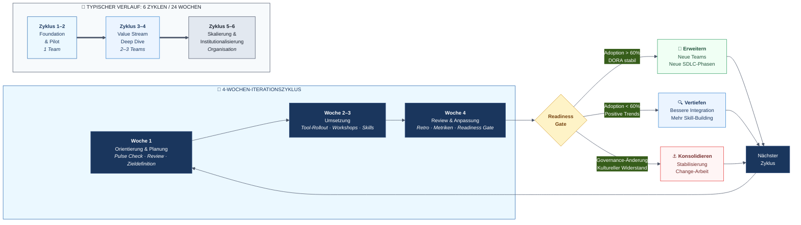
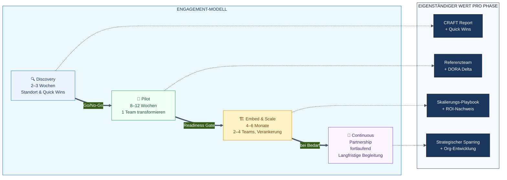

# AI TRANSFORMATION FRAMEWORK – powered by CRAFT

**Ein iteratives Framework zur AI Transformation im Software Development Life Cycle**

Version 1.0 | Februar 2026 | DRAFT
Autor: Jan | AI Transformation Management

---

> **Zweck dieses Dokuments:** Dieses Framework definiert einen ganzheitlichen, iterativen Ansatz zur Integration von AI in den gesamten Software-Wertschöpfungsprozess. Es adressiert gleichberechtigt Technologie, Menschen und Prozesse und liefert konkrete Werkzeuge, Rollen und Metriken für die Umsetzung. Primäre Zielgruppe sind interne Projektteams; das Framework ist zugleich als externer Beratungsservice positionierbar.

---

## Inhaltsverzeichnis

1. [Warum AI-Transformation?](#1-warum-ai-transformation)
2. [Executive Summary](#2-executive-summary)
3. [Framework-Architektur: CRAFT-Dimensionen & Iterativer Prozess](#3-framework-architektur-craft-dimensionen--iterativer-prozess)
4. [Iterationsmodell](#4-iterationsmodell)
5. [KPI-Framework: Outcome statt Output](#5-kpi-framework-outcome-statt-output)
6. [Das AI Adoption Team](#6-das-ai-adoption-team)
7. [Die AI Adoption Roadmap (Kundenergebnis)](#7-die-ai-adoption-roadmap-kundenergebnis)
8. [Engagement-Architektur: Vom Framework zur Wirkung](#8-engagement-architektur-vom-framework-zur-wirkung)
9. [Werkzeuge & Deliverables](#9-werkzeuge--deliverables-übersicht)
10. [Referenzmodelle & Quellen](#10-referenzmodelle--quellen)
11. [Systematische Abgrenzung: Warum ein eigener Ansatz?](#11-systematische-abgrenzung-warum-ein-eigener-ansatz)
12. [Nächste Schritte: Vom Framework zur Anwendung](#12-nächste-schritte-vom-framework-zur-anwendung)

---

## 1. Warum AI-Transformation?

Bevor wir über Frameworks, Dimensionen und Metriken sprechen, steht eine grundlegendere Frage: **Warum sollte eine Organisation ihre Softwareentwicklung überhaupt mit AI transformieren?** Die Antwort liegt in drei Entwicklungen, die sich gegenseitig verstärken.

### 1.1 Die Chancen sind real – und messbar

AI in der Softwareentwicklung ist kein Zukunftsversprechen mehr. Die Produktivitätseffekte sind empirisch belegt und signifikant:

- **55% schnellere Task-Completion:** In einem kontrollierten Experiment mit 95 professionellen Entwicklern schlossen die Teilnehmer mit GitHub Copilot eine Programmieraufgabe in durchschnittlich 1 Stunde 11 Minuten ab – gegenüber 2 Stunden 41 Minuten ohne AI-Unterstützung. Das entspricht einer Beschleunigung von 55%. ([GitHub Research, 2022](https://github.blog/news-insights/research/research-quantifying-github-copilots-impact-on-developer-productivity-and-happiness/))
- **>25% des neuen Codes bei Google ist AI-generiert.** CEO Sundar Pichai bestätigte im Q3-2024-Earnings-Call, dass bereits mehr als ein Viertel des neuen Google-Codes von AI erzeugt und anschließend von Ingenieuren geprüft und übernommen wird. ([Ars Technica / Google Earnings Q3 2024](https://arstechnica.com/ai/2024/10/google-ceo-says-over-25-of-new-google-code-is-generated-by-ai/))
- **Zufriedenheit und Flow:** 60–75% der Copilot-Nutzer berichten höhere Arbeitszufriedenheit; 73% geben an, besser im Flow zu bleiben, und 87% sparen mentale Energie bei repetitiven Aufgaben. ([GitHub Research, 2022](https://github.blog/news-insights/research/research-quantifying-github-copilots-impact-on-developer-productivity-and-happiness/))

Die Implikation: AI-gestützte Entwicklung ist nicht inkrementell besser – sie verändert fundamental, wie schnell Teams iterieren, lernen und liefern können.

### 1.2 Der Leidensdruck ist jetzt

Die Frage ist nicht mehr *ob* Entwickler AI nutzen wollen, sondern ob Organisationen dabei die Steuerung behalten:

- **76% aller Entwickler** nutzen oder planen AI-Tools im Entwicklungsprozess, 62% nutzen sie bereits aktiv. ([Stack Overflow Developer Survey 2024](https://survey.stackoverflow.co/2024/ai), n=60.907)
- **92% der Enterprise-Entwickler** in den USA nutzen AI-Coding-Tools — bei der Arbeit oder privat. ([GitHub Survey 2023](https://github.blog/news-insights/research/survey-reveals-ais-impact-on-the-developer-experience/), n=500 Enterprise-Devs)
- **90% Shadow-AI-Nutzung:** Die [MIT NANDA-Studie](https://mlq.ai/media/quarterly_decks/v0.1_State_of_AI_in_Business_2025_Report.pdf) (2025) zeigt, dass in praktisch jeder untersuchten Organisation Wissensarbeiter AI-Tools ohne offizielle Freigabe nutzen — auf privaten Geräten, ohne Governance, ohne Datenklassifizierung.

Was bedeutet das konkret? Die Transformation findet bereits statt — nur unkontrolliert. Unternehmens-IP fließt in öffentliche LLMs. Compliance-Risiken akkumulieren sich im Verborgenen. Teams experimentieren isoliert, ohne voneinander zu lernen. Die Frage ist nicht ob AI genutzt wird, sondern ob sie **gesteuert oder ungesteuert** genutzt wird.

### 1.3 Nicht-Handeln ist keine Option

Was passiert, wenn eine Organisation die AI-Transformation nicht aktiv gestaltet? Die Datenlage zeigt drei konkrete Risiken:

**Risiko 1: AI ohne Prozessanpassung schadet aktiv.**
Der [DORA Report 2024](https://dora.dev/research/2024/dora-report/) belegt: 25% mehr generative AI-Nutzung korreliert mit 7,2% weniger Stabilität und messbarem Throughput-Rückgang. AI auf bestehende Prozesse zu schrauben, ohne Workflows anzupassen, verschlechtert die Delivery Performance. Das ist kein theoretisches Risiko — es ist eine gemessene Realität.

**Risiko 2: Die Schere zwischen AI-Vorreitern und Nachzüglern wächst.**
[McKinseys State of AI Survey](https://www.mckinsey.com/capabilities/quantumblack/our-insights/the-state-of-ai) (2025) zeigt: Nur 39% der Organisationen sehen überhaupt EBIT-Impact durch AI — und das sind genau die, die Workflows redesigned haben. Workflow-Redesign ist der stärkste Einzelfaktor für messbaren Geschäftswert unter 25 getesteten Attributen — stärker als Budget, Talent oder Tooling. Aber nur 21% haben es tatsächlich getan. Wer jetzt nicht anfängt, Prozesse systematisch zu transformieren, fällt nicht nur zurück — der Abstand wächst mit jedem Quartal, weil AI-gestützte Teams schneller iterieren und lernen.

**Risiko 3: Change Fatigue und Vertrauensverlust.**
[NTT DATA](https://www.nttdata.com/global/en/insights/focus/2024/between-70-85p-of-genai-deployment-efforts-are-failing) berichtet: 75% der Organisationen befinden sich an oder über der Change-Sättigungsgrenze. 45% der Mitarbeiter sind von Change Fatigue betroffen. Jede gescheiterte oder halbherzige AI-Initiative verbraucht Change-Kapital und reduziert die Bereitschaft für zukünftige Veränderungen. Das Fenster, in dem Teams noch offen für eine AI-Transformation sind, schließt sich.

### 1.4 Die Konsequenz

Die Chancen sind real, der Druck ist da, und Nicht-Handeln hat einen messbaren Preis. Die logische Folge: AI-Transformation ist keine Option, sondern eine strategische Notwendigkeit.

Aber — und hier beginnt die eigentliche Herausforderung — **die meisten scheitern auf dem Weg dorthin.** Nicht weil AI nicht funktioniert, sondern weil die Verbindung zwischen AI-Potenzial und konkretem Business-Problem fehlt. AI wird zum Selbstzweck, statt spezifische Herausforderungen zu lösen. Genau dieses Problem adressiert das folgende Framework.

---

## 2. Executive Summary

Die meisten AI-Transformationsinitiativen scheitern nicht an der Technologie, sondern an der Umsetzung. Studien zeigen, dass nur 1% der Organisationen sich als vollständig AI-reif bezeichnen, während gleichzeitig 92% ihre AI-Investitionen erhöhen wollen. Die Lücke zwischen Investment und Impact ist das zentrale Problem.

Das AI Transformation Framework adressiert diese Lücke mit einer **dualen Zielsetzung** und drei Kernprinzipien.

### Duale Zielsetzung: Business-Problem und AI-Fähigkeiten

Jede AI-Transformation hat zwei Motivationen, die sich gegenseitig verstärken. Das Framework macht beide explizit und hält sie durchgängig sichtbar:

| | Linse 1: Business Impact | Linse 2: AI-Befähigung |
|---|---|---|
| **Frage** | Welches konkrete Problem wollen wir lösen? | Wie gut können wir AI systematisch nutzen? |
| **Beispiel** | "Lead Time von 3 Wochen auf 10 Tage senken" | "Von Exploring (Level 1) auf Embedding (Level 3) in Adoption" |
| **Messung** | North Star Metrics (2–3 Metriken, direkt aus Business-Problem abgeleitet) | CRAFT-Scores (5 Dimensionen × 5 Reifestufen) |
| **Frequenz** | Jeder 4-Wochen-Zyklus (Business Problem Check) | Jeder 4-Wochen-Zyklus (Pulse Check); Deep-Dive on-demand |
| **Adressat** | Sponsor / C-Level | AI Adoption Team / Teams |

**Warum beide Linsen nötig sind:**
- Nur Linse 1 (Business Impact) ohne Linse 2 führt zu Aktionismus: Man jagt Metriken, ohne systematisch AI-Fähigkeiten aufzubauen.
- Nur Linse 2 (AI-Befähigung) ohne Linse 1 führt zum Selbstzweck: Man verbessert CRAFT-Scores, ohne zu wissen, ob das dem Business hilft.
- **Zusammen** entsteht der rote Faden: CRAFT-Dimensionen verbessern → North Star Metrics bewegen sich → Business-Problem wird gelöst.

Die North Star Metrics werden im **Business Impact Discovery** (vor dem CRAFT Explorer) definiert: Ein strukturiertes Gespräch, das den konkreten Business-Schmerz identifiziert und in messbare Ziele übersetzt (→ `deliverables/question_banks/business-impact-discovery.md`). Jede Intervention und jedes CRAFT-Dimension-Ziel muss sich an der Frage messen lassen: *Bewegt das unsere North Star Metrics?*

### Kernprinzipien

- **Value Stream First:** Wir beginnen nicht bei Tools, sondern bei den Engpässen im Wertschöpfungsprozess. AI-Interventionen werden dort platziert, wo sie den größten Hebel auf Outcomes haben.
- **Human-Centric Change:** Technologieeinführung ohne begleitenden Change-Prozess produziert Shelfware. Das Framework behandelt Rollenentwicklung, psychologische Sicherheit und Fähigkeitsaufbau als gleichberechtigte Dimensionen.
- **Iterativ statt sequenziell:** Komplexe Transformationen lassen sich nicht in linearen Phasen planen. Das Framework arbeitet mit 4-Wochen-Iterationszyklen, in denen alle Dimensionen parallel adressiert werden.

> **Differenzierungsmerkmal:** Anders als reine Technologie-Frameworks (z.B. Tool-Kataloge) oder reine Strategie-Frameworks (z.B. Maturity-Modelle) verbindet das AI Transformation Framework konkrete technische Umsetzung mit systematischem Change Management entlang des gesamten SDLC. Die duale Zielsetzung — konkreter Business Impact *und* systematischer AI-Fähigkeitsaufbau — stellt sicher, dass die Transformation weder zum Selbstzweck wird noch im Aktionismus versandet. Die Rolle des AI Transformation Managers als orchestrierende Kraft ist dabei zentral.

---

## 3. Framework-Architektur: CRAFT-Dimensionen & Iterativer Prozess

Das Framework besteht aus zwei Ebenen: fünf inhaltlichen **CRAFT-Dimensionen** (was wir steuern und messen) und einem **iterativen Prozessrahmen** (wie wir arbeiten). Die Dimensionen sind gleichzeitig aktiv – jede hat zu jedem Zeitpunkt eine Intensität (von Monitoring bis Deep Work), aber keine ist jemals abgeschlossen. Der Prozessrahmen „Discover & Navigate" bildet das Betriebssystem: er steuert die 4-Wochen-Iterationszyklen und stellt über den CRAFT Explorer Pulse Check sicher, dass alle Dimensionen kontinuierlich gemessen und adressiert werden (siehe Kapitel 4).

### Die 5 CRAFT-Dimensionen

| Dim. | CRAFT | Name | Fokus | Verantwortung |
|------|-------|------|-------|---------------|
| D1 | **C** | Compliance & Governance | Regulatorische Leitplanken, Policies, Betriebsrats-Einbindung, EU AI Act | Governance & Compliance Liaison |
| D2 | **R** | Readiness (Human & Cultural) | Rollenentwicklung, Skill-Aufbau, psychologische Sicherheit, Champion-Netzwerk | Change & People Lead |
| D3 | **A** | Adoption & Usage | Tatsächliche Nutzung im Arbeitsalltag, Verbreitung über SDLC-Phasen, Shadow AI Kanalisierung | AI Transformation Manager |
| D4 | **F** | Flow & Process Integration | SDLC-Analyse, Bottleneck-Identifikation, AI-Intervention-Matching, Workflow-Einbettung | Value Stream Coach |
| D5 | **T** | Technical Enablement | Tool-Bereitstellung, LLM-Deployment, IDE-Integration, Infrastruktur | Technical AI Lead |

```mermaid
---
config:
  theme: base
  themeVariables:
    primaryColor: '#1a365d'
    primaryTextColor: '#ffffff'
    primaryBorderColor: '#2d4a7a'
    secondaryColor: '#2b6cb0'
    tertiaryColor: '#e2e8f0'
    lineColor: '#4a5568'
    fontSize: '14px'
    fontFamily: 'Segoe UI, Arial, sans-serif'
---
flowchart TB
    subgraph CENTER["🔄 AI TRANSFORMATION FRAMEWORK"]
        direction TB
        CORE["<b>4-Wochen-Iterationszyklen</b><br/>Alle Dimensionen gleichzeitig aktiv<br/>Readiness Gates nach jedem Zyklus"]
    end

    subgraph D1["🛡️ C: COMPLIANCE & GOVERNANCE"]
        direction TB
        D1A["Governance Starter Kit<br/><i>3 Sicherheitsstufen</i>"]
        D1B["EU AI Act & Betriebsrat<br/><i>Regulatorische Leitplanken</i>"]
        D1C["Datenklassifizierung<br/><i>Entscheidungsbaum</i>"]
        D1A --> D1B --> D1C
    end

    subgraph D2["👥 R: READINESS (HUMAN & CULTURAL)"]
        direction TB
        D2A["Rollenentwicklung<br/><i>Neue Skill-Profile definieren</i>"]
        D2B["Champion-Netzwerk<br/><i>20% Kapazität, Multiplikatoren</i>"]
        D2C["Psychological Safety<br/><i>Workshops & Kulturarbeit</i>"]
        D2A --> D2B --> D2C
    end

    subgraph D3["📊 A: ADOPTION & USAGE"]
        direction TB
        D3A["Shadow AI Amnestie<br/><i>Kanalisieren statt verbieten</i>"]
        D3B["Nutzungs-Tracking<br/><i>DAU, AI-assisted Commits</i>"]
        D3C["SDLC-Abdeckung<br/><i>Breite über alle Phasen</i>"]
        D3A --> D3B --> D3C
    end

    subgraph D4["🔧 F: FLOW & PROCESS INTEGRATION"]
        direction TB
        D4A["Value Stream Mapping<br/><i>2-Tages-Workshop</i>"]
        D4B["Bottleneck-Analyse<br/><i>Waste & Wartezeiten im SDLC</i>"]
        D4C["AI Intervention Katalog<br/><i>Tool-Matching pro Phase</i>"]
        D4A --> D4B --> D4C
    end

    subgraph D5["⚙️ T: TECHNICAL ENABLEMENT"]
        direction TB
        D5A["Technical Playbooks<br/><i>IDE bis LLM-Deployment</i>"]
        D5B["Tooling-Architektur<br/><i>Public / Private / Air-gapped</i>"]
        D5C["MCP & Prompt Libraries<br/><i>Team-spezifische Integration</i>"]
        D5A --> D5B --> D5C
    end

    D1 <--> CENTER
    D2 <--> CENTER
    D3 <--> CENTER
    D4 <--> CENTER
    D5 <--> CENTER

    D1 -.- D2
    D2 -.- D3
    D3 -.- D4
    D4 -.- D5
    D5 -.- D1

    subgraph MEASURE["📊 KPI: DREI-SCHICHTEN-ARCHITEKTUR"]
        direction LR
        M1["<b>Schicht 1</b><br/>DORA Metrics<br/><i>Delivery Outcomes</i>"]
        M2["<b>Schicht 2</b><br/>CRAFT-Modell<br/><i>AI Maturity</i>"]
        M3["<b>Schicht 3</b><br/>Business Impact<br/><i>EBIT, Time-to-Market</i>"]
        M1 --> M2 --> M3
    end

    CENTER --> MEASURE

    subgraph TEAM["🏗️ AI ADOPTION TEAM"]
        direction LR
        T1["AI Transformation<br/>Manager"]
        T2["Technical<br/>AI Lead"]
        T3["Value Stream<br/>Coach"]
        T4["Change &<br/>People Lead"]
        T5["Governance<br/>Liaison"]
    end

    TEAM --> CENTER

    style CENTER fill:#1a365d,stroke:#2d4a7a,color:#ffffff
    style D1 fill:#ebf8ff,stroke:#2b6cb0,color:#1a365d
    style D2 fill:#ebf4ff,stroke:#3182ce,color:#1a365d
    style D3 fill:#fef3c7,stroke:#d69e2e,color:#744210
    style D4 fill:#f0fff4,stroke:#38a169,color:#22543d
    style D5 fill:#faf5ff,stroke:#805ad5,color:#44337a
    style MEASURE fill:#f7fafc,stroke:#4a5568,color:#1a202c
    style TEAM fill:#fff5f5,stroke:#e53e3e,color:#742a2a
    style CORE fill:#1a365d,stroke:#2d4a7a,color:#ffffff
```

### Iterativer Prozessrahmen: Discover & Navigate

Der Prozessrahmen ist das Betriebssystem der Transformation. Er ersetzt die klassische einmalige Bestandsaufnahme durch eine kontinuierliche Standortbestimmung und folgt einem PDCA-Zyklus (Plan – Do – Check – Adjust) in 4-Wochen-Iterationen (siehe Kapitel 4). Wir sprechen bewusst von **Exploration** statt Assessment — der Prozess ist ein gemeinsames Erkunden, keine Prüfung. Werkzeuge dafür sind der **CRAFT Explorer** (App) und der **Pulse Check** als regelmäßiger Durchlauf.

#### CRAFT Explorer (App)

Eine interaktive Anwendung, die vom AI Transformation Manager begleitet wird. Sie ist bewusst nicht als Audit konzipiert, sondern als gemeinsames Explorations-Werkzeug. Teams führen die Erhebung eigenständig durch; Analyse, Auswertung und Ableitung der nächsten Schritte erfolgen immer durch den AI Transformation Manager.

- **Format:** Web-App, flexibel einsetzbar in unterschiedlichen Kontexten (standalone, Teams-Integration, Workshop-Begleitung).
- **Begleitetes Modell:** Durchführung der Exploration durch das Team, Analyse und Handlungsempfehlungen durch AI Transformation Manager. Keine unbegleitete Auswertung.
- **Ablauf:** Deep-Dive (Kickoff-Baseline, alle 5 Dimensionen) → Analyse & Spider-Chart → erste Interventionen → Pulse Check (jeden 4-Wochen-Zyklus, Trend-Tracking) → Deep-Dive bei Bedarf (on-demand, wenn Pulse Check Auffälligkeiten zeigt).
- **Dauer:** ~15–20 Minuten pro Deep-Dive-Dimension (einmalig), ≤15 Minuten pro Pulse Check (jeden Zyklus).
- **Output:** Team-Dashboard mit Scores über die 5 CRAFT-Dimensionen (siehe Kapitel 5), Radar-Chart, Stärken-/Schwächen-Analyse und Handlungsempfehlungen, die gemeinsam in die Roadmap einfließen.
- **Benchmark:** Anonymisierter Vergleich mit anderen Teams als zusätzlicher Impuls.

#### Drei-Ebenen-Explorations-Architektur

Die Standortbestimmung erfolgt über drei aufeinander aufbauende Ebenen. Jede Ebene hat einen eigenen Zweck, Respondenten-Kreis und Rhythmus:

| Ebene | Zweck | Frequenz | Respondent | Dauer |
|-------|-------|----------|------------|-------|
| **1: Context & Readiness** | Fakten und Rahmenbedingungen erfassen (Branche, Team, Tech-Stack, Budget) | Einmalig (Kickoff) | AI Transformation Manager / Tech Lead (1–2 Personen, nicht anonym) | ~30 Min |
| **2: Pulse Check** | CRAFT-Spider-Score (1–5) pro Dimension tracken, Trends erkennen | Jeden 4-Wochen-Zyklus (Woche 1) | Alle Teammitglieder (anonym) | ≤15 Min |
| **3: Deep-Dives** (5×) | Granulare Sub-Topic-Analyse pro Dimension (je 4 Sub-Topics) | 1× Kickoff (Baseline) + on-demand | Alle Teammitglieder (anonym) | ~15–20 Min pro Dimension |

**Beziehung Pulse Check ↔ Deep-Dive:** Der Pulse Check ist ein *Extrakt* der Deep-Dives. Jede Pulse-Check-Maturity-Frage (z.B. C-M1) fasst die 4 Sub-Topics des entsprechenden Deep-Dives zusammen. Deep-Dives liefern das granulare *Warum*, der Pulse Check trackt den *Trend*.

> **Design-Methodik:** Alle Explorations-Prinzipien (Scoring-Formeln, Kalibrierungsregeln, Visualisierung, Anonymität) sind in `deliverables/question_banks/METHODOLOGY.md` dokumentiert. Die YAML-Dateien in `deliverables/question_banks/` sind die Source of Truth für alle Fragen. Die Fragen folgen dem **Backward-Design-Ansatz** (Wiggins & McTighe, 2005): Ausgehend von typischen Herausforderungen pro Dimension werden diagnostische Signale identifiziert und die Fragen so konstruiert, dass sie diese Herausforderungen aufdecken. Die systematische Challenge-Herausforderungs-Analyse ist in `deliverables/question_banks/CHALLENGE-MAP.md` dokumentiert.

#### Kontext-Profile

Organisationen unterscheiden sich fundamental in ihren Rahmenbedingungen — eine agile Digital-Agentur hat andere Herausforderungen als eine regulierte Bank. Um die Interpretation der CRAFT-Scores zu kontextualisieren, nutzt das Framework vier archetypisierte Kontext-Profile:

| Profil | Kennzeichen | Typische Schwerpunkte |
|--------|-------------|----------------------|
| **Agil & Offen** | Flache Hierarchien, Cloud-native, wenig Regulierung | Policy-Vakuum, Shadow AI, fehlende Messbarkeit |
| **Enterprise Reguliert** | Starke Regulierung, komplexe Governance, große IT | Governance-Bottleneck, Compliance-Angst, Manager als Bremse |
| **Public Sector** | Betriebsrat, Datenschutz, lange Entscheidungswege | Breite Hürden über alle Dimensionen, Tool-Mangel, Existenzangst |
| **Konzern Liberal** | Große Organisation, aber innovationsfreundlich | Coding-Only-Adoption, Stagnation bei oberflächlicher Nutzung |

**Anwendungsprinzip:** Dieselben Fragen werden allen Teams gestellt (Vergleichbarkeit). Das Profil beeinflusst ausschließlich die **Interpretation** der Ergebnisse — welche Herausforderungen bei niedrigen Scores am wahrscheinlichsten sind und welche Interventionen am wirksamsten. Die vollständige Profil-Relevanz-Matrix für alle 30 typischen Herausforderungen ist in `deliverables/question_banks/CHALLENGE-MAP.md` dokumentiert.

#### Pulse Check Inhalte

Der Pulse Check erfasst pro CRAFT-Dimension 2–3 Fragen: 1 Maturity-Frage (5-Level, konkrete Verhaltensbeschreibungen von *Exploring* bis *Evolving*) + 1–2 MC-Diagnostik-Fragen (erklären das Warum). Keine Likert-Skalen — jede Maturity-Stufe beschreibt konkretes Verhalten, nicht Zustimmungsgrade. Beispiel: „Ich weiß nicht, welche AI-Tools ich nutzen darf" (Level 1) vs. „Compliance ist in meinen Workflow integriert" (Level 5).

### 3.1 Dimension 1: Compliance & Governance (C)

Governance ist keine Phase, sondern die durchgängige Leitplanke, innerhalb derer alles andere passiert. Ohne mindestens eine Grundfreigabe startet kein Pilot. Gleichzeitig darf Governance nicht zum Blocker werden.

#### Governance Starter Kit

- **Policy-Vorlagen:** Vordefinierte AI-Nutzungs-Policies für drei Sicherheitsstufen: Public Cloud erlaubt, Private Cloud only, Air-gapped.
- **Entscheidungsbaum Datenklassifizierung:** Systematische Prüfung: Darf dieser Code-Kontext / dieses Dokument an ein externes LLM?
- **Betriebsrats-Abstimmung:** Vorlagen und Leitfäden für die frühzeitige Einbindung des Betriebsrats. In deutschen Konzernen ist dies häufig der kritische Pfad.
- **EU AI Act Konformität:** Zuordnung der eingesetzten AI-Systeme zu Risikokategorien, Dokumentationsanforderungen.
- **IP-Schutz:** Leitlinien für den Umgang mit AI-generiertem Code, Lizenzen und geistigem Eigentum.

#### Tooling-Architektur nach Sicherheitsstufe

| Sicherheitsstufe | Architektur | Beispiel-Setup |
|------------------|-------------|----------------|
| Stufe 1: Public Cloud | SaaS-basierte AI-Services mit Enterprise-Verträgen und Data Processing Agreements | GitHub Copilot Business, Claude Pro/Team, ChatGPT Enterprise |
| Stufe 2: Private Cloud | AI-Services im eigenen Cloud-Tenant, Daten verlassen nicht die kontrollierte Umgebung | Azure OpenAI Service, AWS Bedrock, Google Vertex AI in eigenem Tenant |
| Stufe 3: Air-gapped | On-Premise-Deployment auf dedizierter GPU-Infrastruktur, vollständig isoliert vom Internet | Ollama/vLLM mit Llama, Mistral, DeepSeek; Continue.dev als IDE-Plugin mit lokalem Backend |

### 3.2 Dimension 2: Readiness – Human & Cultural (R)

Die meisten Frameworks behandeln Change Management als Appendix. Im AI Transformation Framework ist es eine gleichberechtigte Dimension, die Rollenentwicklung, Skill-Aufbau und kulturelle Bereitschaft umfasst. Der Grund: In Teams mit 300+ Personen ist die psychologische Barriere fast immer größer als die technische. Die zentrale Angst lautet: „Ersetzt mich die KI?"

#### Shadow AI Amnestie

Statt zu verbieten, was ohnehin passiert, wird die bestehende AI-Nutzung in den Teams transparent gemacht und kanalisiert. Studien zeigen, dass 40–60% der Wissensarbeiter bereits AI-Tools ohne offizielle Freigabe nutzen. Die Amnestie reduziert sofort das Compliance-Risiko und signalisiert den Teams, dass ihre Initiative wertgeschätzt wird.

#### Rollenentwicklungsmodell

Aktive Definition, wie sich Rollen weiterentwickeln – nicht ob, sondern wie:

| Bisherige Rolle | Neue Schwerpunkte | Neue Fähigkeiten |
|-----------------|-------------------|------------------|
| Junior Developer | AI-augmented Developer: Prompts designen, AI-Output reviewen, schnellere Iteration | Prompt Engineering, AI Output Evaluation, Code Review Skills |
| Senior Developer | AI Architect: Systemdesign, AI-Integration-Entscheidungen, Qualitätssicherung | AI Tool Evaluation, Architektur-Patterns für AI, Mentoring |
| Tester/QA | Quality Intelligence: AI-gestützte Teststrategie, Testdaten-Design, Oversight | AI Test Tools, Synthetic Data, Testautomatisierungs-Architektur |
| Product Owner | AI-informed Product Leader: Datengetriebene Priorisierung, AI-Möglichkeiten kennen | AI Use Case Identification, Data Literacy, Outcome-Messung |

#### Champion-Netzwerk

Pro Team werden 1–2 Personen als AI Champions identifiziert. Sie sind keine formalen Führungskräfte, sondern Multiplikatoren aus den Teams heraus. Entscheidend: Champions bekommen dedizierte Zeit (mindestens 20% ihrer Kapazität) und direkten Zugang zum AI Transformation Manager. Ohne Zeitbudget wird die Rolle nicht ernst genommen.

#### Psychological Safety Workshop

Ein moderierter Workshop (halber Tag), der drei Ziele verfolgt: offener Umgang mit Ängsten und Bedenken rund um AI, gemeinsame Definition der neuen Rollenbilder (siehe oben), und konkrete Vereinbarungen, wie das Team mit AI-Experimenten umgeht (Fehlertoleranz, Lernkultur, Feedback-Prozesse).

### 3.3 Dimension 3: Adoption & Usage (A)

Die entscheidende Frage jeder Transformation lautet nicht „Haben wir Tools bereitgestellt?", sondern „Werden sie tatsächlich genutzt?" Adoption & Usage misst und fördert die reale Durchdringung von AI im Arbeitsalltag – über alle SDLC-Phasen hinweg.

#### Adoption-Monitoring

- **Daily Active Users / Team Size:** Wie viele Teammitglieder nutzen AI-Tools tatsächlich täglich?
- **AI-assisted Commits (%):** Welcher Anteil der Code-Commits wird mit AI-Unterstützung erstellt?
- **SDLC-Phasen-Abdeckung:** Wird AI nur in der Entwicklung genutzt, oder auch in Requirements, Testing, Documentation und Operations?
- **Nutzungstiefe:** Werden nur einfache Completions genutzt, oder auch komplexere Anwendungen wie Code Review, Testgenerierung und Architektur-Diskussionen?

#### Von Shadow AI zu Managed AI

Die Shadow AI Amnestie (siehe Dimension R) liefert den Startpunkt: Bestehende informelle Nutzung wird sichtbar gemacht und in offizielle Kanäle überführt. Eine sinkende Shadow-AI-Rate bei gleichzeitig steigender offizieller Adoption ist einer der aussagekräftigsten Indikatoren für eine gelingende Transformation.

#### Adoption-Barrieren systematisch adressieren

Typische Barrieren und ihre Gegenmaßnahmen:

| Barriere | Gegenmaßnahme |
|----------|---------------|
| „Ich weiß nicht, wie ich anfangen soll" | Prompt Libraries, Onboarding-Sessions, Champion als Ansprechpartner |
| „Die Tools sind zu umständlich" | Technical Enablement (D5) verbessern, IDE-Integration priorisieren |
| „Ich darf das nicht / bin unsicher" | Governance-Freigabe kommunizieren, klare Nutzungsrichtlinien |
| „Bringt mir nichts" | Value Stream Workshop zeigt konkrete Pain Points, Quick Wins identifizieren |

### 3.4 Dimension 4: Flow & Process Integration (F)

Das Herzstück des Frameworks und der zentrale Differenzierungspunkt. Hier geht es nicht um Technologie-Einführung, sondern um die systematische Analyse und Optimierung des gesamten Software-Wertschöpfungsprozesses.

#### Value Stream Mapping Workshop

Ein strukturierter 2-Tages-Workshop, in dem das Team seinen tatsächlichen End-to-End-Prozess visualisiert – von der Anforderung bis zum Deployment. Die Methodik orientiert sich am Lean Value Stream Mapping, adaptiert für den SDLC-Kontext.

- **Tag 1:** Ist-Zustand kartieren. Alle Schritte, Übergaben, Liegezeiten, Qualitäts-Gates. Dabei werden systematisch Bottlenecks und Waste identifiziert.
- **Tag 2:** AI-Interventionspunkte zuordnen. Erst jetzt kommt der AI Intervention Katalog ins Spiel: Welche konkreten Lösungen passen zu welchem Bottleneck?

#### AI Intervention Katalog

Ein kuratiertes, lebendes Dokument, das SDLC-Phasen konkreten AI-Lösungsansätzen zuordnet. Der Katalog wird unter Leitung des Technical AI Lead mit AI-Unterstützung gepflegt.

| SDLC-Phase | AI-Interventionen | Beispiel-Tooling |
|------------|-------------------|------------------|
| Requirements & Design | AI-gestützte User Story Refinement, automatische Akzeptanzkriterien, Architecture Decision Records mit LLM | Claude, ChatGPT, Copilot Chat |
| Development | Code Completion, AI-assisted Refactoring, Pair Programming mit LLM, Code Generation | GitHub Copilot, Continue.dev, Cline, Claude Code, Cursor |
| Testing | Automatisierte Testgenerierung, Synthetic Test Data, AI-basierte Test-Priorisierung | Copilot, Diffblue Cover, Testim |
| Documentation | Automatische API-Docs, Release Notes Generation, Knowledge Base Maintenance | Claude, Mintlify, Swimm |
| Operations | AI-gestütztes Incident Management, Log-Analyse, Predictive Monitoring | Datadog AI, Dynatrace Davis AI |
| Security & Review | Automated Code Review, Vulnerability Detection, Compliance Checking | Snyk, SonarQube AI, CodeQL |

Jeder Eintrag im Katalog enthält: konkretes Tooling mit Alternativen für verschiedene Sicherheitsstufen (Public Cloud / Private Cloud / Air-gapped), geschätzten Implementierungsaufwand, erwarteten Impact auf die Value Stream Metriken und technische Voraussetzungen.

#### Katalogpflege mit AI-Unterstützung

- **Monitoring:** Automatisierter Scan neuer Tools und Modelle (RSS, GitHub Trending, Changelog-Feeds). AI fasst Neuerungen zusammen, der Technical AI Lead bewertet und entscheidet.
- **Erfahrungsdokumentation:** Champions dokumentieren ihre Tool-Erfahrungen strukturiert. AI identifiziert Muster und aggregiert Feedback über Teams hinweg.
- **Kontextuelle Empfehlungen:** Basierend auf dem Pulse-Check-Ergebnis eines Teams schlägt der Katalog automatisch passende Interventionen vor.

#### Commercial Flow Alignment

Ein oft übersehener, aber strukturell kritischer Aspekt der Flow-Dimension: Der kommerzielle Rahmen, in dem Teams arbeiten, kann AI-Transformation systematisch blockieren.

**Das T&M-Paradoxon:**

Unter Time & Material-Verträgen führt AI-Effizienz unmittelbar zu weniger abrechenbaren Stunden. Dieser Mechanismus erzeugt systemische Fehlanreize:

- **Champions-Kapazität** (20% dedizierte Zeit) ist gegenüber dem Kunden kaum begründbar
- **Tooling-Investitionen** ohne direkten Stunden-ROI werden intern nicht genehmigt
- **VSM-Workshops und Change-Aufwände** lassen sich ohne explizite Kunden-Anforderung nicht verbuchen
- **Shadow AI** entsteht, weil offizielle Adoption die Stundenzahl sichtbar reduziert

Das MIT NANDA-Datenpunkt „95% Piloten scheitern" hat hier eine oft unbeachtete Ursache: nicht fehlende Technologie, sondern strukturell falsch ausgerichtete Geschäftsmodelle.

**Vertragsmodell-Kompatibilitätsmatrix:**

| Vertragsmodell | Incentive-Alignment | AI-Transformation-Readiness |
|----------------|---------------------|---------------------------------|
| Time & Material | ❌ Bestraft Effizienz | Niedrig — aktive Intervention nötig |
| Fixed Price | ⚠️ Neutral (Effizienz = interne Marge) | Mittel — funktioniert wenn intern supportet |
| Hybrid (T&M + Success Bonus) | ✅ Teilweise aligned | Mittel-Hoch |
| Outcome-Based / Gainsharing | ✅✅ Belohnt Effizienz direkt | Hoch — optimaler Rahmen |

**Aufgabe des Value Stream Coach — Commercial Flow Check:**

Im Kickoff jeder Transformation wird das Vertragsmodell als Flow-Constraint bewertet. Bei T&M-Identifikation gibt es drei Interventionspfade:

1. **Innovation Budget:** Dediziertes „AI Transformation Budget" außerhalb T&M mit dem Kunden verhandeln — oft einfacher als direkte Vertragsumstellung
2. **Vertragsrunde als Opportunity:** Nächste Vertragsverlängerung aktiv für Modell-Wechsel nutzen; Gainsharing-Pilot als „risikominimale Einstiegsoption" positionieren
3. **Transparenz-Strategie:** Effizienzgewinne explizit sichtbar machen — Kunden, die die AI-Vorteile konkret sehen, sind häufig offen für Modellwechsel

**Erweiterung des AI Intervention Katalogs:**

Commercial Flow Interventionen werden als übergeordnete Kategorie im Katalog geführt:

| Intervention | Trigger | Verantwortung |
|---|---|---|
| Contract Model Review + Empfehlung | Kickoff, immer | Value Stream Coach |
| Kunden-Workshop „AI-First Commercial Models" | T&M + Awareness-Lücke beim Kunden | AI Transformation Manager |
| Gainsharing Pilot Design | T&M > 12 Monate, Effizienzgewinne messbar | Value Stream Coach + AI Transformation Manager |
| Innovation Budget Verhandlung | T&M + kurzfristiger Investitionsbedarf | AI Transformation Manager + Sponsor |

### 3.5 Dimension 5: Technical Enablement (T)

Die konkrete technische Umsetzungsunterstützung – hier wird das Framework hands-on. Ziel ist es, die Reibung zwischen Wollen und Können zu minimieren.

#### Technical Playbook pro Sicherheitsstufe

Konkrete Setup-Anleitungen, die vom IDE-Plugin bis zum LLM-Deployment alles abdecken:

- **IDE-Integration:** VS Code / IntelliJ / JetBrains Setup mit AI-Plugins (Copilot, Continue.dev, Cline), konfiguriert mit organisationsspezifischen System Prompts und Context-Regeln.
- **MCP-Server-Integration:** Anbindung von Datenquellen und internen Systemen an AI-Tools über das Model Context Protocol.
- **Prompt Libraries:** Team-spezifische Prompt-Sammlungen für wiederkehrende Aufgaben (Code Review, Test Generation, Documentation).
- **Hardware-Sizing:** Für Air-gapped Umgebungen: GPU-Dimensionierung, Modellauswahl (quantisierte Modelle vs. Full-Size), Performance-Benchmarks.

---

## 4. Iterationsmodell

Das Framework arbeitet mit 4-Wochen-Iterationszyklen, die alle 5 Dimensionen berühren, aber mit wechselndem Schwerpunkt. Dies ersetzt das klassische Drei-Wellen-Modell (Foundation → Acceleration → Integration), das in komplexen Konzernumgebungen regelmäßig an der Realität scheitert.

**Verankerung der dualen Zielsetzung im Zyklus:**

Jeder Iterationszyklus verfolgt beide Linsen gleichzeitig (siehe Kapitel 2):

- **Linse 1 (Business Impact):** Im Business Impact Discovery wurden 2–3 **North Star Metrics** definiert, die das konkrete Business-Problem messen. Jeder Zyklus beginnt und endet mit der Frage: *Bewegen sich unsere North Star Metrics?* Der Business Problem Check in Woche 4 ist das formale Instrument dafür.
- **Linse 2 (AI-Befähigung):** Die **CRAFT-Scores** zeigen, wie gut das Team AI systematisch nutzen kann. Verbesserungen in den CRAFT-Dimensionen sind der *Hebel*, über den sich die North Star Metrics verbessern — aber nur wenn die richtigen Dimensionen adressiert werden.

Die Verbindung: Wenn die North Star Metrics sich nicht bewegen, obwohl CRAFT-Scores steigen, stimmt das Interventions-Portfolio nicht (falsche Dimension, falscher Bottleneck). Wenn die CRAFT-Scores nicht steigen, fehlen Voraussetzungen für Business Impact. Der Iterationszyklus steuert beides.

### 4.1 Zyklus-Struktur (4 Wochen)

| Woche | Fokus | Aktivitäten |
|-------|-------|-------------|
| Woche 1 | Orientierung & Planung | **Pulse Check** durchführen, Review der Ergebnisse aus dem Vorzyklus (CRAFT-Scores + North Star Metrics), Zieldefinition für den neuen Zyklus, Abstimmung mit Sponsoren |
| Woche 2–3 | Umsetzung | Tool-Rollout und Konfiguration, Value Stream Workshops, Change-Workshops, Governance-Klärungen, Skill-Building-Sessions |
| Woche 4 | Review & Anpassung | **Business Problem Check** (North Star Metrics zuerst), Retrospektive mit dem Team, Metriken-Review (DORA, Adoption), Readiness Gate Entscheidung, Anpassung des nächsten Zyklus |

### 4.2 Business Problem Check (Woche 4)

Bevor die Readiness-Gate-Entscheidung fällt, wird der **Business Problem Check** durchgeführt. Er stellt sicher, dass die Transformation nicht zum Selbstzweck wird, sondern auf das identifizierte Business-Problem fokussiert bleibt.

**Ablauf (15–20 Min, Teil des Woche-4-Reviews):**

1. **North Star Metrics Review:** Wie haben sich die 2–3 North Star Metrics (definiert im Business Impact Discovery) seit dem letzten Zyklus entwickelt? Delta quantifizieren.
2. **Interventions-Alignment:** Adressieren die aktuellen Interventionen das identifizierte Business-Problem — oder optimieren wir an der falschen Stelle?
3. **Root Cause Check:** Gibt es Root Causes hinter dem ursprünglich wahrgenommenen Symptom, die wir noch nicht adressieren? (Beispiel: Das Symptom war "langsame Delivery", aber die Root Cause ist "fehlende Testautomatisierung", nicht "fehlende AI-Tools".)
4. **Kurskorrektur:** Falls die North Star Metrics stagnieren oder sich verschlechtern: Welche Anpassung ist nötig? Neue Interventionen? Andere CRAFT-Dimension priorisieren? Problem-Definition schärfen?

> **Leitfrage für den AI Transformation Manager:** *"Wenn ich dem Sponsor heute erklären müsste, wie diese Transformation sein Business-Problem löst — was genau würde ich sagen?"* Wenn die Antwort nicht klar und konkret ist, fehlt der rote Faden.

### 4.3 Readiness Gates

Nach dem Business Problem Check steht die Readiness-Gate-Entscheidung: Wird der nächste Zyklus den Scope erweitern (neue Teams, neue SDLC-Phasen), vertiefen (bessere Integration in bestehenden Teams) oder konsolidieren (Stabilisierung, bevor weiter skaliert wird)? Diese Entscheidung trifft das AI Adoption Team gemeinsam mit dem Sponsor.

> **Readiness Gate Kriterien (Beispiele):**
> - **Erweiterung:** Adoption Rate im Pilot > 60%, DORA-Metriken stabil oder verbessert, kein offener Governance-Blocker, **North Star Metrics zeigen positiven Trend**.
> - **Vertiefung:** Adoption Rate < 60% oder DORA-Verschlechterung, aber positive Cultural Readiness Trends. Oder: **North Star Metrics stagnieren trotz guter CRAFT-Scores** (→ falsche Interventionen?).
> - **Konsolidierung:** Governance-Änderungen stehen an, Teamumbau, oder kultureller Widerstand erfordert zusätzliche Change-Arbeit.

### 4.4 Typischer Verlauf (6 Zyklen / 24 Wochen)

| Zyklus | Schwerpunkt | Erwartete Ergebnisse |
|--------|-------------|----------------------|
| 1–2 | Foundation & erster Pilot | Governance-Grundlagen stehen, erstes Pulse Check durchgeführt, ein aufgeschlossenes Pilot-Team arbeitet mit ersten AI-Tools, Shadow AI Amnestie durchgeführt |
| 3–4 | Value Stream Deep Dive & Rollout | Value Stream Mapping in Pilotteams abgeschlossen, AI-Interventionen für Top-3-Bottlenecks implementiert, Change-Workshops gestartet, Champion-Netzwerk aktiv |
| 5–6 | Skalierung & Institutionalisierung | Learnings aus Pilot auf 2–3 weitere Teams übertragen, KPI-Baseline etabliert, Rollenentwicklungsmodell in HR-Prozesse integriert, zweiter Pulse Check zeigt messbaren Fortschritt |

---

## 5. KPI-Framework: Outcome statt Output

Das Mess-System folgt drei Prinzipien: Outcomes messen statt Output zählen, auf etablierte Metriken aufbauen statt neue erfinden, und minimalen Overhead erzeugen durch automatisierte Erhebung wo immer möglich.

### 5.1 Drei-Schichten-Architektur

#### Schicht 1: Delivery Outcomes (DORA + Value Stream)

Die DORA Metrics sind der Goldstandard für Software Delivery Performance. Sie werden vor und während der Transformation erhoben, um den Delta sichtbar zu machen. Ergänzt um Value-Stream-spezifische Metriken:

| Metrik | Was sie misst | Erhebung |
|--------|---------------|----------|
| Deployment Frequency | Wie oft wird in Produktion deployt? | Automatisch aus CI/CD-Pipeline |
| Lead Time for Changes | Wie lange von Commit bis Produktion? | Automatisch aus CI/CD-Pipeline |
| Change Failure Rate | Welcher Anteil der Deployments verursacht Fehler? | Automatisch aus Incident-Management |
| Time to Restore Service | Wie schnell werden Fehler behoben? | Automatisch aus Incident-Management |
| Cycle Time (E2E) | Von Anforderung bis Produktion | Aus Jira / Azure DevOps / GitLab |
| Flow Efficiency | Aktive Bearbeitung vs. Wartezeit | Aus Value Stream Mapping + Tool-Daten |

#### Schicht 2: AI Maturity – Das CRAFT-Modell

Ein 5-Dimensionen-Modell, zugeschnitten auf den SDLC-Kontext. Jede CRAFT-Dimension korrespondiert direkt mit einer Framework-Dimension (D1–D5) – die Handlungsdimension und ihr KPI-Gegenstück sind deckungsgleich. Das Modell wird über zwei komplementäre Instrumente erhoben:

- **Pulse Check** (jeden 4-Wochen-Zyklus): 1 Maturity-Frage pro Dimension → Spider-Score = Median über alle Respondenten (1–5)
- **Deep-Dives** (Kickoff-Baseline + on-demand): 4 Sub-Topics pro Dimension → Spider-Score = (Median × 0.6) + (Minimum × 0.4)

Die Min-gewichtete Formel der Deep-Dives verhindert, dass kritische Schwächen im Durchschnitt verschwinden. Ein Sub-Topic auf Level 1 bleibt als Blocker sichtbar, egal wie gut die anderen Sub-Topics sind. Alle Maturity-Fragen folgen einem universellen 5-Level-Progressionsmuster mit konkreten Verhaltensbeschreibungen (keine Likert-Skalen), um Vergleichbarkeit über Dimensionen und Zeit zu gewährleisten.

- **C – Compliance & Governance (D1):** Sind regulatorische Leitplanken etabliert und werden sie eingehalten?
- **R – Readiness, Human & Cultural (D2):** Können und wollen die Menschen AI effektiv und kritisch nutzen?
- **A – Adoption & Usage (D3):** Wird AI tatsächlich im Arbeitsalltag genutzt – und breit über den SDLC?
- **F – Flow & Process Integration (D4):** Ist AI in SDLC-Prozesse und Workflows eingebettet oder ein Fremdkörper?
- **T – Technical Enablement (D5):** Wie gut ist die AI-Infrastruktur verfügbar und integriert?

> **Methodik-Referenz:** Die vollständige Scoring-Logik, Kalibrierungsregeln und Visualisierungsprinzipien sind in `deliverables/question_banks/METHODOLOGY.md` dokumentiert.

```mermaid
---
config:
  theme: base
  themeVariables:
    primaryColor: '#1a365d'
    primaryTextColor: '#ffffff'
    lineColor: '#4a5568'
    fontSize: '13px'
---
flowchart TB
    CRAFT["<b>CRAFT AI MATURITY MODEL</b><br/><i>5 Dimensionen × 5 Reifestufen</i>"]

    CRAFT --> CC
    CRAFT --> R
    CRAFT --> A
    CRAFT --> F
    CRAFT --> T

    subgraph CC["<b>C</b> – Compliance & Governance"]
        direction LR
        C1["Governance<br/>Compliance Score"]
        C2["Policy-Abdeckung<br/><i>pro Sicherheitsstufe</i>"]
        C3["BR/EU AI Act<br/>Status"]
    end

    subgraph R["<b>R</b> – Readiness (Human & Cultural)"]
        direction LR
        R1["Skill Self-Rating"]
        R2["Prompt Quality Score"]
        R3["Vertrauensindex &<br/>Champion-Meldungen"]
    end

    subgraph A["<b>A</b> – Adoption & Usage"]
        direction LR
        A1["Daily Active Users<br/><i>÷ Team Size</i>"]
        A2["AI-assisted<br/>Commits (%)"]
        A3["Nutzungsverteilung<br/><i>über SDLC-Phasen</i>"]
    end

    subgraph F["<b>F</b> – Flow & Process Integration"]
        direction LR
        F1["SDLC-Phasen mit<br/>AI-Interventionen"]
        F2["Flow Efficiency<br/><i>aktiv vs. Wartezeit</i>"]
        F3["CI/CD-<br/>Integration"]
    end

    subgraph T["<b>T</b> – Technical Enablement"]
        direction LR
        T1["Tool Availability Score"]
        T2["Integration Depth<br/><i>standalone → IDE → workflow</i>"]
        T3["Modellabdeckung<br/><i>pro SDLC-Phase</i>"]
    end

    subgraph LEVELS["REIFESTUFEN"]
        direction LR
        L1["1️⃣ Exploring"]
        L2["2️⃣ Experimenting"]
        L3["3️⃣ Embedding"]
        L4["4️⃣ Scaling"]
        L5["5️⃣ Evolving"]
        L1 --> L2 --> L3 --> L4 --> L5
    end

    CRAFT -.-> LEVELS

    style CRAFT fill:#1a365d,stroke:#2d4a7a,color:#ffffff
    style CC fill:#fef3c7,stroke:#d69e2e,color:#744210
    style R fill:#f0fff4,stroke:#38a169,color:#22543d
    style A fill:#ebf8ff,stroke:#2b6cb0,color:#1a365d
    style F fill:#ebf4ff,stroke:#3182ce,color:#1a365d
    style T fill:#faf5ff,stroke:#805ad5,color:#44337a
    style LEVELS fill:#f7fafc,stroke:#4a5568,color:#1a202c
    style L1 fill:#fed7d7,stroke:#e53e3e,color:#742a2a
    style L2 fill:#fef3c7,stroke:#d69e2e,color:#744210
    style L3 fill:#fefcbf,stroke:#d69e2e,color:#744210
    style L4 fill:#c6f6d5,stroke:#38a169,color:#22543d
    style L5 fill:#b2f5ea,stroke:#319795,color:#234e52
```

#### CRAFT Reifestufen

| Stufe | Bezeichnung | Beschreibung |
|-------|-------------|--------------|
| 1 | Exploring | Bewusstsein ist da, aber keine systematische Nutzung. Einzelne Enthusiasten experimentieren. |
| 2 | Experimenting | Erste Piloten laufen, erste Erfahrungen werden gesammelt, noch keine Standardisierung. |
| 3 | Embedding | Definierte Prozesse, breite Nutzung im Team, AI ist Teil des Workflows aber noch nicht flächendeckend. |
| 4 | Scaling | AI ist Teil des Standardprozesses, messbare Outcome-Verbesserungen, Skalierung auf weitere Teams läuft. |
| 5 | Evolving | Kontinuierliche Optimierung, AI treibt Prozessinnovation, Team gestaltet aktiv neue Arbeitsweisen. |

#### CRAFT Metriken pro Dimension

| Dimension | Metriken | Erhebungsart |
|-----------|----------|--------------|
| C – Compliance | Governance Compliance Score, Policy-Abdeckung pro Sicherheitsstufe, BR/EU AI Act Freigabestatus | Pulse Check + Governance-Tracking |
| R – Readiness | Skill Self-Rating, Prompt Quality Score (anonymisiert), Anteil Teammitglieder mit AI-Schulung, Vertrauensindex, Champion-Meldungen, Workshop-Teilnahme | Pulse Check + Tool-Daten |
| A – Adoption | Daily Active Users / Team Size, AI-assisted Commits (%), Nutzungsverteilung über SDLC-Phasen, **Usage Mode Maturity** (Chat → integriert → agentisch), Shadow AI Rate (sinkend = positiv) | Automatisch aus Tool-Telemetrie + Pulse Check |
| F – Flow | Anteil SDLC-Phasen mit definierten AI-Interventionen, Flow Efficiency (aktiv vs. Wartezeit), CI/CD-Integration, **Commercial Flow Alignment Score** (Vertragsmodell-Kompatibilität) | Pulse Check + Pipeline-Daten + Context Readiness |
| T – Technical | Tool Availability Score, Integration Depth (standalone vs. IDE-integriert vs. Workflow-integriert), Modellabdeckung pro SDLC-Phase, **supported usage mode** (welche Modi sind offiziell/technisch möglich) | Automatisch + Pulse Check |

#### Schicht 3: Business Impact (für Sponsoren)

Schicht 3 arbeitet **dual — Top-down und Bottom-up:**

**Top-down: North Star Metrics (primär)**

Die 2–3 North Star Metrics werden im Business Impact Discovery (vor der CRAFT Exploration) gemeinsam mit dem Sponsor definiert. Sie messen direkt das identifizierte Business-Problem und sind die Headline-Metriken im Sponsor-Reporting.

- **Quelle:** Direkt gemessen aus den Systemen, die das Business-Problem abbilden (z.B. CI/CD für Lead Time, HR-System für Attrition, Jira für Cycle Time)
- **Frequenz:** Zyklisch (alle 4 Wochen im Business Problem Check) + quartalsweise an Sponsoren
- **Beispiele:** Median Lead Time, Change Failure Rate, Code Review Cycle Time, Developer Satisfaction Score, Effort pro Story Point

**Bottom-up: Aggregierte CRAFT + DORA Kennzahlen (ergänzend)**

Aggregation aus Schicht 1 und 2 in geschäftssprachliche Kennzahlen: Velocity-Veränderung, Time-to-Market-Verbesserung, Qualitätsveränderung (aus Change Failure Rate) und Mitarbeiterzufriedenheit (aus Cultural Readiness). Wird automatisch generiert und quartalsweise an Sponsoren kommuniziert.

**Zusammenspiel:** Die North Star Metrics zeigen, *ob* das Business-Problem gelöst wird. Die Bottom-up-Aggregation zeigt, *warum* (oder warum nicht) — welche CRAFT-Dimensionen und DORA-Metriken die Veränderung treiben. Beide zusammen ergeben das vollständige Bild für Sponsoren.

> **Overhead-Minimierung:** Die meisten Metriken werden automatisch aus bestehenden Tools erhoben (CI/CD, Jira, IDE-Telemetrie). Der Pulse Check ist das einzige Element, das aktive Beteiligung erfordert – maximal 15 Minuten pro Zyklus (alle 4 Wochen). Kein zusätzliches Reporting-System, keine Excel-Tabellen, keine manuellen KPI-Erhebungen. Die North Star Metrics nutzen dieselben Datenquellen, die ohnehin vorhanden sind.

### 5.4 Wirkmodell: Kausalkette von CRAFT zu Business Impact

CRAFT-Dimensionen verbessern sich nicht im Selbstzweck — sie sollen messbare Business-Outcomes bewegen. Die entscheidende Frage: *Welche Dimension bewegt welche Metrik, auf welchem Weg, und in welchem Zeitrahmen?* Das Wirkmodell macht diese Kausalkette explizit.

#### Die drei Rollen der CRAFT-Dimensionen

| Rolle | Dimensionen | Funktion in der Kausalkette |
|---|---|---|
| **Primäre Value Driver** | **F** (Flow), **A** (Adoption) | Erzeugen direkt messbare Delivery-Outcomes. DORA-Verbesserungen und North Star-Bewegungen laufen primär über F und A. |
| **Voraussetzung** | **R** (Readiness) | Bestimmt, ob F und A nachhaltig wirken. Adoption ohne psychologische Sicherheit bleibt oberflächlich und episodisch. |
| **Freischalter** | **C** (Compliance), **T** (Technical) | Müssen ein Mindest-Level erreichen, damit die Value Driver greifen. Ihr eigenes Business-Impact-Potenzial ist gering — ihr Blockade-Potenzial ist hoch. |

**Konsequenz für die Praxis:** C und T sind prioritär zu adressieren, wenn sie gerade aktiv blockieren — nicht als Selbstzweck. R ist eine Daueraufgabe, die A absichert. Der eigentliche Hebel auf Lead Time, CFR und North Stars liegt in F und A.

#### Wirkmodell-Tabelle

| Dimension | Operativer Hebel | Lead Indicator | Typische North-Star-Wirkung | Zeitverzug | Bedingung |
|---|---|---|---|---|---|
| **F – Flow** | SDLC-Bottlenecks + AI-Interventionen → Wartezeiten sinken | Flow Efficiency ↑, Cycle Time per Phase ↓ | Lead Time, CFR, Cycle Time (direkte Wirkung) | 1–2 Zyklen | A ≥ Level 2 |
| **A – Adoption** | AI-Nutzung setzt Kapazität frei, SDLC-Phasen-Abdeckung wächst | DAU/Team ↑, AI-assisted Commits % ↑ | Lead Time, Effort/Story Point, Dev Satisfaction | 1–3 Zyklen | F ≥ Level 2 |
| **R – Readiness** | Psychologische Sicherheit + Skill-Aufbau machen Adoption nachhaltig | Skill-Rating ↑, Champion-Aktivität ↑ | Developer Satisfaction → Attrition (langfristig) | 2–4 Zyklen | Immer nötig |
| **C – Compliance** | Governance-Blocker beseitigen, freigegebene Tools ermöglichen breite Nutzung | Approved-Tool-Count ↑, Shadow-AI-Rate ↓ | Unblocks A + T; kein eigenständiger North-Star-Effekt | 1–2 Zyklen | Wenn C aktiv blockiert |
| **T – Technical** | Tools verfügbar, integriert, sicher | Tool Availability Score, Integration Depth | Unblocks A + F; kein eigenständiger North-Star-Effekt | Relativ sofort | Wenn T aktiv fehlt |

#### Hypothesen-Pflicht pro Intervention

Jede Intervention muss vor dem Start eine explizite Hypothese haben:

> *„Wenn wir [Intervention X] in Dimension [D] durchführen, dann verbessert sich [Lead Indicator] von [Ist] auf [Ziel] innerhalb [T] Wochen, weil [Wirkmechanismus], was danach [North Star Metric] um [Delta] bewegen sollte. Wenn das nicht eintritt, prüfen wir [Confounders / Pivot]."*

Diese Hypothesen werden im **Business Problem Check (Woche 4)** überprüft — nicht um recht zu behalten, sondern um die tatsächliche Kausalkette zu verstehen und Interventionen ggf. zu pivoten.

#### Wann die Kopplung schwach ist

Die Verbindung CRAFT → Business-Wert ist nicht deterministisch. In diesen Situationen ist Vorsicht geboten:

- **Externe Dominanz:** Marktveränderungen, Teamumbau oder neue Anforderungen können North-Star-Metriken stärker beeinflussen als jede Intervention. Immer auf Confounders prüfen.
- **Zu frühes Reifegrad:** Level 1→2 erzeugt kaum messbaren Business-Impact. Zuverlässige DORA-Verbesserung beginnt ab **Level 3 (Embedding) auf F und A**.
- **Adoption ohne Flow-Integration:** Wenn A steigt, F aber auf Level 1 bleibt, verbessern Entwickler ihre persönliche Effizienz — ohne dass der Produktivitätsgewinn im Lead-Time-Delta landet.

> **Vollständiges Wirkmodell und Hypothesen-Template:** `deliverables/question_banks/business-impact-discovery.md`, Teil 3b.

---

## 6. Das AI Adoption Team

Angelehnt an Kotters Konzept der Guiding Coalition ist das AI Adoption Team das organisatorische Rückgrat der Transformation. Es ist heterogen zusammengesetzt, um alle Facetten (Technik, Mensch, Prozess, Governance) abzudecken, und arbeitet unter Leitung des AI Transformation Managers mit expliziter Unterstützung des Senior Managements.

Kotter definiert vier Kerncharakteristiken für eine wirksame Guiding Coalition: Position Power (Entscheidungsbefugnis), Expertise (Fachkompetenz), Credibility (Glaubwürdigkeit) und Leadership (Fähigkeit, andere mitzunehmen). Das AI Adoption Team bildet alle vier ab.

### 6.1 Kernrollen

| Rolle | Verantwortung | Kotter-Dimension | Kapazität |
|-------|---------------|------------------|-----------|
| AI Transformation Manager (Leitung) | Orchestrierung aller 5 Dimensionen, Steuerung der Iterationszyklen, Verbindung zum Senior Management, Coaching der Champions | Leadership + Credibility | 100% |
| Technical AI Lead | Tool-Landschaft und Infrastruktur, Pflege des AI Intervention Katalogs, LLM-Bewertung, technische Playbooks | Expertise | 50–100% |
| Value Stream Coach | Value Stream Mapping, DORA-Metriken-Interpretation, Verbindung zwischen AI-Intervention und Wertschöpfung | Expertise | 50–80% |
| Change & People Lead | Psychological Safety Workshops, Rollenentwicklung, Champion-Coaching, Skill-Aufbau | Leadership | 50–80% |
| Governance & Compliance Liaison | Datenschutz, Betriebsrat, IT-Security, EU AI Act, Policy-Pflege | Position Power | 20–40% |

#### Champion-Netzwerk (erweiterte Coalition)

1–2 Personen pro Team, die als Multiplikatoren wirken. Sie sind Kotters „Volunteer Army" – nicht Teil des Kernteams, aber direkt angebunden. Champions bringen die Realität aus den Teams zurück und tragen Impulse hinein. Voraussetzung: mindestens 20% dedizierte Kapazität und direkter Zugang zum AI Transformation Manager.

### 6.2 Ideal- vs. Mindestbesetzung

| Szenario | Besetzung | Einschränkungen |
|----------|-----------|-----------------|
| Idealbesetzung (ab 5 Teams / 50+ Personen) | Alle 5 Kernrollen + Champion-Netzwerk | Volle Abdeckung aller Dimensionen |
| Standardbesetzung (2–4 Teams) | AI Transformation Manager (100%), Technical AI Lead (50%), Change & People Lead (50%), Governance Liaison (on demand) | Value Stream Coaching wird vom AI Transformation Manager mit abgedeckt |
| Mindestbesetzung (1 Pilot-Team) | AI Transformation Manager (50–100%) + 1–2 Champions im Team | Governance und technische Tiefe müssen extern zugekauft oder eskaliert werden |

### 6.3 Die Rolle des AI Transformation Managers

Dies ist die Schlüsselrolle des gesamten Frameworks. Der AI Transformation Manager ist kein Projektmanager und kein Agile Coach – er ist ein Brückenbauer zwischen allen Dimensionen mit einem einzigartigen Kompetenzprofil:

- **Technische Tiefe:** Versteht AI-Tools, LLM-Grundlagen und Infrastruktur-Entscheidungen ausreichend, um mit Technical Leads auf Augenhöhe zu sprechen.
- **Change-Kompetenz:** Kann Workshops moderieren, mit Widerständen umgehen und psychologische Sicherheit schaffen.
- **Value-Stream-Denken:** Versteht End-to-End-Wertschöpfung und kann Bottlenecks identifizieren.
- **Stakeholder-Management:** Kann mit C-Level, Betriebsrat und Entwicklerteams gleichermaßen kommunizieren.
- **Iterative Steuerung:** Beherrscht agile Methoden und kann Transformationszyklen adaptiv steuern.

> **Organisatorische Verankerung:** Die Rolle des AI Transformation Managers soll innerhalb der Organisation institutionalisiert und gestärkt werden – mit eigenem Ausbildungspfad, klarem Karrierepfad und Sichtbarkeit im Senior Management. Es handelt sich nicht um eine temporäre Projektrolle, sondern um eine dauerhafte Transformationskompetenz.

---

## 7. Die AI Adoption Roadmap (Kundenergebnis)

Am Ende des Beratungsprozesses (oder nach den ersten 2 Iterationszyklen bei interner Anwendung) erhält das Team bzw. die Organisation eine individuelle AI Adoption Roadmap. Diese wird aus den Ergebnissen des CRAFT Explorer Pulse Checks, des Value Stream Mappings und der Governance-Analyse generiert.

### 7.1 Roadmap-Bestandteile

- **Ist-Analyse:** CRAFT-Radar-Chart mit aktuellem Maturity-Stand pro Dimension, identifizierte Stärken und Schwächen, Benchmark gegen Vergleichsteams.
- **Value Stream Analyse:** Visualisierter Ist-Prozess mit identifizierten Bottlenecks und Liegezeiten, priorisierte AI-Interventionspunkte mit erwarteten Impacts.
- **Governance-Rahmen:** Definierte Sicherheitsstufe, freigegebene Policies, Status der Betriebsrats-Abstimmung.
- **Iterationsplan:** Konkrete Ziele für die nächsten 4–6 Zyklen mit Schwerpunkten, Readiness-Gate-Kriterien und Meilensteinen.
- **Team-Setup:** AI Adoption Team Besetzung, Champion-Zuordnung, Kapazitätsplanung.
- **KPI-Baseline:** Aktuelle DORA-Metriken und CRAFT-Scores als Ausgangspunkt für die Erfolgsmessung.

### 7.2 Skalierungsmodell

Der Übergang von einem erfolgreichen Pilot zu einer breiten Adoption ist der schwierigste Sprung. Das Framework adressiert dies mit einem expliziten Skalierungsmechanismus:

- **Pilot-Phase (Zyklus 1–2):** Ein Team, geschützter Rahmen, hohe Betreuungsintensität durch das AI Adoption Team.
- **Ausweitung (Zyklus 3–4):** 2–3 weitere Teams, Learnings aus dem Pilot werden über Champions transferiert. AI Adoption Team verschiebt Fokus von Hands-on zu Enabling.
- **Institutionalisierung (Zyklus 5+):** Standards sind definiert, Playbooks existieren, neue Teams können sich weitgehend selbst onboarden. AI Adoption Team wird zum Center of Excellence.

> **Kritischer Erfolgsfaktor Skalierung:** Die häufigste Falle: Ein erfolgreicher Pilot wird als Beweis genommen, dass die Transformation „funktioniert", und sofort auf 20 Teams ausgerollt. Ohne die schrittweise Ausweitung mit Readiness Gates und Champion-Transfer scheitert die Skalierung regelmäßig an mangelnder Betreuungskapazität und fehlendem kontextuellem Verständnis.

---

## 8. Engagement-Architektur: Vom Framework zur Wirkung

Die vorherigen Kapitel beschreiben *was* wir steuern (CRAFT-Dimensionen), *wie* wir arbeiten (Iterationsmodell) und *wie* wir messen (KPI-Framework). Dieses Kapitel beantwortet die vier Fragen, die jeder Sponsor und jedes Projektteam stellt, bevor eine Transformation beginnt: Was gewinnen wir? Wie arbeiten wir zusammen? Was kostet das? Und wie halten wir das Risiko gering?

### 8.1 Value Proposition: Was die Organisation gewinnt

Die Wertversprechen des Frameworks lassen sich auf drei Ebenen formulieren:

**Ebene 1: Messbare Delivery-Verbesserung**
Die empirische Basis ist belastbar (vgl. Kapitel 1): 55% schnellere Task-Completion, 25%+ AI-generierter Code bei Vorreitern, messbare DORA-Verbesserungen bei korrekt integrierter AI. Das Framework stellt sicher, dass diese Potenziale nicht nur als Einzeleffekte verpuffen, sondern systematisch im gesamten SDLC realisiert werden.

**Ebene 2: Reduziertes Transformationsrisiko**
Die Failure Rate von AI-Initiativen liegt bei 80-95% (MIT NANDA, S&P Global, RAND). Das Framework adressiert die drei empirisch identifizierten Hauptursachen: fehlende Prozessanpassung (Dimension F: Value Stream First), fehlendes Change Management (Dimension R: Human-Centric) und fehlende cross-funktionale Koordination (AI Adoption Team mit Readiness Gates).

**Ebene 3: Befähigung statt Abhängigkeit**
Das Engagement-Modell ist auf Wissenstransfer ausgelegt. Jede Phase baut interne Kompetenz auf: Champions werden ausgebildet, Playbooks werden übergeben, das KPI-System läuft autonom. Das Ziel ist nicht maximale Beratungsdauer, sondern maximale Selbststeuerungsfähigkeit der Organisation.

### 8.2 Engagement-Modell: Vier Phasen der Zusammenarbeit

Das Engagement-Modell folgt direkt aus der Framework-Architektur — jede Phase nutzt spezifische Framework-Komponenten und liefert eigenständigen Wert:

| Phase | Framework-Komponenten | Was der Kunde erhält | Typischer Umfang |
|-------|----------------------|---------------------|------------------|
| **Discovery** | CRAFT Explorer Deep-Dive, Kontext-Profil, Shadow AI Scan | CRAFT Maturity Report, Spider-Chart, Top-5 Quick Wins, Go/No-Go für Pilot | 2-3 Wochen, 8-12 PT |
| **Pilot Begleitung** | Iterationszyklen 1-3, VSM Kurzformat, Champion Onboarding, Governance Starter Kit | Referenzteam mit messbarem DORA-Delta, Value Stream Map, angepasste Governance Policy | 8-12 Wochen, 25-40 PT |
| **Embed & Scale** | Skalierungsmodell (Kap. 7.2), Pulse Check Etablierung, Rollenentwicklung, KPI-Dashboard | Skalierungs-Playbook, Champion-Netzwerk, ROI-Nachweis, Übergabe an interne Capability | 4-6 Monate, 50-80 PT |
| **Continuous Partnership** | Alle Framework-Dimensionen im Coaching-Modus, strategische Steuerung, Organisationsentwicklung | Kontinuierliche Weiterentwicklung, strategischer Sparringspartner, organisationale Verankerung | Fortlaufend, 4-8 PT/Monat |

**Discovery, Pilot und Embed & Scale** folgen der klassischen Options-Logik: kleine initiale Investition, evidenzbasierte Entscheidung, stufenweise Erhöhung des Commitments. Jede Phase liefert eigenständigen Wert — eine Organisation, die nach dem Pilot nicht skaliert, hat trotzdem ein transformiertes Referenzteam, dokumentierte Verbesserungen und ausgebildete Champions.

**Continuous Partnership** adressiert Kontexte, in denen eine vollständige Übergabe nicht sinnvoll oder nicht gewünscht ist:

- **Große Organisationen** mit vielen Teams, Standorten und Geschäftsbereichen, in denen die Skalierung schrittweise über 12+ Monate läuft und kontinuierliche Orchestrierung erfordert.
- **Regulatorisch komplexe Umgebungen**, in denen sich Compliance-Anforderungen (EU AI Act, Branchenregulierung) schnell ändern und permanentes Governance-Monitoring nötig ist.
- **Schnell evolvierende Tool-Landschaften**, in denen ein externer Sparringspartner Wert schafft, weil er die Breite der Marktentwicklung über viele Kunden hinweg sieht.
- **Organisationen mit schwacher interner Change-Kapazität**, die eine langfristige Begleitung für den kulturellen Wandel brauchen.

In diesem Modell verschiebt sich die Rolle vom operativen Enabler zum strategischen Partner: weniger Workshops, mehr Coaching. Weniger direkte Umsetzung, mehr Sparring und Qualitätssicherung. Die Intensität sinkt, der strategische Hebel steigt.

> **Marketing-Aspekt:** Der modulare Aufbau erleichtert den Einstieg. Eine Organisation kann mit einer Discovery beginnen (geringes Commitment, hoher Informationsgewinn) und bei Erfolg natürlich in die nächste Phase wachsen. Das reduziert die Einstiegshürde und die Abschlussgröße des ersten Engagements — und erhöht die Wahrscheinlichkeit einer langfristigen Partnerschaft durch nachgewiesene Wirksamkeit.

### 8.3 Investitionsschutz: Warum das Risiko kontrollierbar ist

Das Framework hat vier strukturelle Eigenschaften, die das Investitionsrisiko systematisch begrenzen:

**1. Eingebaute Feedback Loops**
Der Pulse Check liefert alle 4 Wochen objektive Evidenz über den Fortschritt — keine Selbsteinschätzung des Beraters, sondern anonyme Team-Daten und automatisierte DORA-Metriken. Wenn eine Dimension stagniert, wird das nach spätestens einem Zyklus sichtbar.

**2. Readiness Gates als Stop/Go-Mechanik**
Nach jedem 4-Wochen-Zyklus steht eine bewusste Entscheidung (vgl. Kap. 4.2): Erweitern, Vertiefen oder Konsolidieren. Das verhindert die klassische Falle, zu schnell zu skalieren, bevor der Boden bereitet ist. Es verhindert aber auch, dass Engagement-Phasen sich endlos fortsetzen ohne Ergebnis.

**3. Kosten-Risiko-Asymmetrie der Discovery**
Die Discovery-Phase (8-12 PT) ist die kleinste Investition mit dem größten Informationsgewinn. Nach 2-3 Wochen weiß die Organisation: Wo stehen wir? Wo sind die größten Hebel? Lohnt sich ein Pilot? Die Ergebnisse (CRAFT Report, Quick Wins) haben unabhängig von der Folgeentscheidung eigenständigen Wert.

**4. Modularer Aufbau mit eigenständigem Wert**
Jede Phase liefert abgeschlossene Deliverables. Selbst wenn eine Organisation nach dem Pilot nicht skaliert, hat sie: ein transformiertes Referenzteam, dokumentierte DORA-Verbesserungen, ein funktionierendes Governance-Setup und ausgebildete Champions, die intern weiterwirken.

> **Kosten der Nicht-Transformation:** Dem Investitionsrisiko steht ein mindestens ebenso reales Risiko des Nicht-Handelns gegenüber (vgl. Kap. 1.3): unkontrollierte Shadow AI mit Compliance-Risiken, wachsender Wettbewerbsnachteil durch langsamere Delivery-Zyklen, und die Erosion von Change-Kapital durch jede halbherzige oder gescheiterte AI-Initiative.

### 8.4 Ergebnismatrix: Was Sie in welcher Phase erwarten können

Die folgende Matrix verbindet jede Engagement-Phase mit konkreten, messbaren Ergebnissen — zugeordnet zu den drei KPI-Schichten (vgl. Kap. 5):

| Phase | Delivery Outcomes (Schicht 1) | AI Maturity (Schicht 2) | Business Impact (Schicht 3) |
|-------|-------------------------------|------------------------|----------------------------|
| **Discovery** | DORA-Baseline erhoben | CRAFT-Scores als Ausgangspunkt, Stärken/Schwächen identifiziert | Business Case für Pilot quantifiziert |
| **Pilot** | DORA-Delta messbar (Ziel: stabil oder verbessert), Flow Efficiency sichtbar | CRAFT-Score Verbesserung in mind. 2 Dimensionen | Quick Wins realisiert, Pilot-ROI dokumentiert |
| **Embed & Scale** | DORA-Verbesserung über 2-4 Teams, Cycle Time Reduktion | CRAFT-Score >=3 in allen Dimensionen (Embedding-Level) | Velocity-Steigerung, Time-to-Market-Verbesserung quantifiziert |
| **Continuous Partnership** | Kontinuierliche DORA-Optimierung, organisationsweite Benchmarks | CRAFT-Scores auf Scaling/Evolving-Level (4-5) | Strategische AI-Reife als Wettbewerbsvorteil, AI treibt Prozessinnovation |

> **Operative Details** (Personentage, Preismodell, Add-ons, Kontext-Profil-Empfehlungen) sind im separaten Service-Dokument detailliert: `deliverables/craft-service-offerings.md`. Das ermöglicht eine unabhängige Aktualisierung operativer Parameter, ohne die Framework-Dokumentation zu verändern.

---

## 9. Werkzeuge & Deliverables (Übersicht)

Das Framework ist mehr als ein Strategiepapier. Folgende konkrete Werkzeuge und Deliverables werden bereitgestellt oder müssen entwickelt werden:

| Werkzeug | Beschreibung | Status | Priorität |
|----------|--------------|--------|-----------|
| CRAFT Explorer App | Web-basierte App für CRAFT Explorer (Deep-Dive + Pulse Check), begleitet durch AI Transformation Manager. Generiert CRAFT-Scores und Radar-Chart als Grundlage für gemeinsame Roadmap-Ableitung | Zu entwickeln | Hoch |
| CRAFT Explorer | Drei-Ebenen-Fragenarchitektur (Context & Readiness + Pulse Check + 5 Deep-Dives) mit Design-Methodik. 7 YAML-Dateien + METHODOLOGY.md in `deliverables/question_banks/` | **v2.0 fertig** | Hoch |
| Challenge Map | Systematische Herausforderungs-Analyse: 30 typische Herausforderungen (6 pro CRAFT-Dimension) mit Root Causes, diagnostischen Signalen, Kausalketten und Profil-Relevanz-Matrix. Basis für Backward Design der Fragen. `deliverables/question_banks/CHALLENGE-MAP.md` | **v1.0 fertig** | Hoch |
| AI Intervention Katalog | Kuratierte Zuordnung von SDLC-Phasen zu AI-Lösungen mit Tooling-Alternativen pro Sicherheitsstufe | Entwurf vorhanden | Hoch |
| Interventionskatalog Readiness (R) | Score-basierte Interventionsempfehlungen für Dimension R mit Diagnostik-Mapping, Steckbriefen und Priorisierungsmatrix. `deliverables/intervention-catalogue-readiness.md` | **v1.0 DRAFT** | Hoch |
| Value Stream Mapping Template | Workshop-Material und Vorlagen für den 2-Tages-VSM-Workshop | Zu entwickeln | Hoch |
| Governance Starter Kit | Policy-Vorlagen, Entscheidungsbaum, Betriebsrats-Leitfaden | Teilweise vorhanden | Hoch |
| Technical Playbooks | Setup-Anleitungen pro Sicherheitsstufe (IDE bis LLM-Deployment) | Teilweise vorhanden | Mittel |
| Rollenentwicklungs-Framework | Neue Skill-Profile, Lernpfade, angepasste Bewertungskriterien | Zu entwickeln | Mittel |
| AI Transformation Manager Handbuch | Aufgabenprofil, Kompetenzen, Ausbildungspfad, Rollenabgrenzung | Zu entwickeln | Hoch |
| Champion Onboarding Kit | Einführungsmaterialien, Kommunikationsvorlagen, Zeitbudget-Vereinbarung | Zu entwickeln | Mittel |
| Psychological Safety Workshop Design | Moderationsleitfaden, Übungen, Ergebnisvorlagen | Zu entwickeln | Mittel |
| KPI Dashboard Template | Automatisierte Aggregation von DORA + CRAFT für Sponsoren-Reporting | Zu entwickeln | Mittel |

---

## 10. Referenzmodelle & Quellen

Das Framework baut auf etablierten Modellen und aktueller Forschung auf, statt alles neu zu erfinden:

### 10.1 AI Maturity Modelle

- **MITRE AI Maturity Model:** 6 Säulen, 20 Dimensionen, 5 Reifestufen. Frei verfügbar, validiert, Fokus auf Organisation. Basis für die CRAFT-Dimensionierung. → [MITRE AI MM](https://aida.mitre.org/ai-maturity-model/)
- **SEI / Accenture AI Adoption Maturity Model (2025):** 8 Dimensionen inkl. Workforce & Culture und Workflow Re-engineering. 5 Stufen von Exploratory bis Future-Ready. Besonders relevant für den Workflow-Fokus unseres Frameworks. → [SEI/Accenture AI Adoption MM](https://insights.sei.cmu.edu/library/ai-adoption-maturity-model/)
- **Gartner AI Maturity Model:** 5 Stufen (Awareness → Active → Operational → Systemic → Transformational). Breit genutzt als Benchmark. → [Gartner AI Maturity](https://www.gartner.com/en/articles/an-ai-maturity-model-to-help-plan-your-ai-journey)
- **EY.ai Maturity Model:** 7 Dimensionen, 15-Minuten-Self-Assessment. Vorbild für den Zeitrahmen unseres Pulse Checks. → [EY.ai Maturity](https://www.ey.com/en_gl/ai/maturity-assessment)
- **OWASP AI Maturity Assessment (2025):** 5 Domains (Strategy, Design, Implementation, Operations, Governance). Relevant für den Security-Aspekt. → [OWASP AIMA](https://owaspai.org/docs/ai_security/maturity/)

### 10.2 Change Management

- **Kotter 8 Accelerators:** Weiterentwicklung des klassischen 8-Step-Modells hin zu einem dynamischen, nicht-linearen Ansatz. Basis für die Guiding Coalition / AI Adoption Team Struktur. → [Kotter Inc.](https://www.kotterinc.com/methodology/8-steps/)
- **Prosci ADKAR:** Individuelle Change-Perspektive (Awareness, Desire, Knowledge, Ability, Reinforcement). Ergänzend für die Human-Dimension. → [Prosci ADKAR](https://www.prosci.com/methodology/adkar)

### 10.3 Software Delivery & Value Stream

- **DORA Metrics:** Deployment Frequency, Lead Time, Change Failure Rate, Time to Restore. Goldstandard für Delivery Performance. → [DORA / Google Cloud](https://dora.dev/)
- **Lean Value Stream Mapping:** Methodik zur Visualisierung und Optimierung von Wertströmen. Adaptiert für den SDLC-Kontext. → [Lean Enterprise Institute](https://www.lean.org/lexicon-terms/value-stream-mapping/)
- **SAFe (Scaled Agile Framework):** Referenz für die Skalierung agiler Praktiken in Konzernen. → [SAFe Framework](https://scaledagileframework.com/)

### 10.4 Survey-Design & Diagnostische Methodik

- **Wiggins, G. & McTighe, J. (2005): Understanding by Design.** Backward-Design-Prinzip: Von den gewünschten Erkenntnissen (typische Herausforderungen) rückwärts zu den diagnostischen Fragen. Methodische Grundlage für die Challenge-Map und die Konstruktion der CRAFT Explorer Fragen.
- **DeVellis, R. F. (2017): Scale Development — Theory and Applications.** Standard-Referenz für Fragebogen-Konstruktion. Informiert die Gestaltung der Maturity-Stufen und diagnostischen MC-Optionen.
- **Tourangeau, R., Rips, L. J. & Rasinski, K. (2000): The Psychology of Survey Response.** Basis für das Verständnis von Response-Verzerrungen (Social Desirability, Acquiescence Bias) und die Normalisierungs-Framing-Technik in sensitiven Fragen.
- **Podsakoff, P. M. et al. (2003): Common Method Biases.** Informiert die Cross-Validation-Strategie: Maturity-Fragen als Selbsteinschätzung werden durch diagnostische MC-Fragen (Verhaltensindikatoren) abgesichert.
- **Flanagan, J. C. (1954): The Critical Incident Technique.** Methodische Inspiration für die Powerful Questions — offene Fragen, die kritische Momente und reale Erfahrungen erfassen.
- **Weisbord, M. R. (1976): Organizational Diagnosis — Six Places to Look.** Konzeptuelle Grundlage für die Multi-Dimensionen-Diagnostik über fünf CRAFT-Dimensionen.
- **Burke, W. W. & Litwin, G. E. (1992): A Causal Model of Organizational Performance and Change.** Informiert die Kausalketten in der Challenge Map — wie Herausforderungen in einer Dimension andere auslösen.

### 10.5 Empirische Studien zur AI-Transformation (2024–2025)

- **MIT NANDA – „The GenAI Divide: State of AI in Business 2025":** 95% der Enterprise-AI-Piloten ohne messbaren P&L-Impact. 90% Shadow-AI-Nutzung. Hauptblocker: brittle workflows, fehlende kontextuelle Lernfähigkeit. → [MIT NANDA Report (PDF)](https://mlq.ai/media/quarterly_decks/v0.1_State_of_AI_in_Business_2025_Report.pdf)
- **McKinsey – „The State of AI 2025: Agents, Innovation, and Transformation":** Workflow-Redesign = stärkster Faktor für EBIT-Impact unter 25 getesteten Attributen. Nur 21% der Organisationen haben Workflows redesigned. Nur 39% sehen überhaupt EBIT-Impact. → [McKinsey State of AI 2025](https://www.mckinsey.com/capabilities/quantumblack/our-insights/the-state-of-ai)
- **McKinsey – „How Organizations Are Rewiring to Capture Value" (März 2025):** CEO-Oversight + Workflow-Redesign als stärkste Kombination für messbaren AI-Geschäftswert. → [McKinsey Rewiring Report](https://www.mckinsey.com/capabilities/quantumblack/our-insights/the-state-of-ai-how-organizations-are-rewiring-to-capture-value)
- **S&P Global Market Intelligence (2025):** 42% der Unternehmen haben 2025 die Mehrheit ihrer AI-Initiativen eingestellt (vs. 17% in 2024). 46% der POCs vor Produktionsreife abgebrochen.
- **Bain & Company (2024):** 88% der Business-Transformationen verfehlen ihre ursprünglichen Ziele.
- **RAND Corporation:** Über 80% der AI-Projekte scheitern – doppelt so häufig wie Non-AI-IT-Projekte. Kernursache: fehlende cross-funktionale Koordination.
- **NTT DATA – „Between 70-85% of GenAI Deployment Efforts Are Failing":** 75% der Organisationen an oder über der Change-Sättigungsgrenze. 45% der Mitarbeiter von Change Fatigue betroffen. → [NTT DATA Analysis](https://www.nttdata.com/global/en/insights/focus/2024/between-70-85p-of-genai-deployment-efforts-are-failing)
- **DORA Report 2024:** 25% mehr generative AI-Nutzung korreliert mit 7,2% weniger Stabilität und messbarem Throughput-Rückgang – Beleg für die These, dass AI ohne Prozessanpassung schaden kann.

### 10.6 AI-Produktivitätsstudien & Developer Surveys

- **GitHub Research – „Quantifying GitHub Copilot's Impact on Developer Productivity and Happiness" (2022):** Kontrolliertes Experiment mit 95 professionellen Entwicklern: Copilot-Nutzer schließen Tasks 55% schneller ab (1h11min vs. 2h41min, P=.0017). 60–75% berichten höhere Arbeitszufriedenheit, 73% besseren Flow, 87% weniger mentale Belastung bei repetitiven Aufgaben. → [GitHub Research](https://github.blog/news-insights/research/research-quantifying-github-copilots-impact-on-developer-productivity-and-happiness/)
- **GitHub Survey – „AI's Impact on the Developer Experience" (2023):** 92% der US-Enterprise-Entwickler nutzen AI-Coding-Tools (bei der Arbeit oder privat). 70% sehen signifikante Vorteile. 81% erwarten, dass AI-Tools die Team-Kollaboration verbessern. → [GitHub Survey](https://github.blog/news-insights/research/survey-reveals-ais-impact-on-the-developer-experience/)
- **Google Q3 2024 Earnings Call (Oktober 2024):** CEO Sundar Pichai bestätigt, dass mehr als 25% des neuen Google-Codes von AI generiert und anschließend von Ingenieuren geprüft und übernommen wird. → [Ars Technica Bericht](https://arstechnica.com/ai/2024/10/google-ceo-says-over-25-of-new-google-code-is-generated-by-ai/)
- **Stack Overflow Developer Survey 2024:** 76% aller Entwickler nutzen oder planen AI-Tools im Entwicklungsprozess (Anstieg von 70% im Vorjahr). 62% nutzen sie bereits aktiv. 81% nennen Produktivitätssteigerung als wichtigsten Vorteil. → [SO Developer Survey 2024 – AI](https://survey.stackoverflow.co/2024/ai)

---

## 11. Systematische Abgrenzung: Warum ein eigener Ansatz?

Dieses Kapitel beantwortet drei Fragen: Was übernehmen wir von bestehenden Modellen – und warum? Warum reicht keines dieser Modelle allein? Und worauf stützt sich unsere Überzeugung, dass der kombinierte Ansatz funktioniert, auch ohne eigene Pilotdaten?

### 11.1 Das Kernproblem: Adoption ohne Transformation

Die Datenlage ist eindeutig und ernüchternd. Die [MIT NANDA-Studie „The GenAI Divide"](https://mlq.ai/media/quarterly_decks/v0.1_State_of_AI_in_Business_2025_Report.pdf) (2025) zeigt: Während über 80% der Organisationen AI-Tools pilotiert haben, erreichen nur 5% der Enterprise-AI-Initiativen die Produktionsreife mit messbarem P&L-Impact. S&P Global berichtet, dass 42% der Unternehmen 2025 die Mehrheit ihrer AI-Initiativen eingestellt haben – ein Anstieg von 17% im Vorjahr. [McKinseys State of AI Survey](https://www.mckinsey.com/capabilities/quantumblack/our-insights/the-state-of-ai) (2025) bestätigt: Über 80% der Organisationen sehen keinen messbaren EBIT-Impact durch AI. Bains Studie von 2024 beziffert die allgemeine Transformations-Failure-Rate sogar auf 88%.

Die Ursachen sind dabei konsistent über alle Studien hinweg: es sind keine Technologieprobleme, sondern Transformationsprobleme. MIT identifiziert „brittle workflows" und fehlende kontextuelle Lernfähigkeit als Hauptblocker. [McKinsey zeigt](https://www.mckinsey.com/capabilities/quantumblack/our-insights/the-state-of-ai-how-organizations-are-rewiring-to-capture-value), dass Workflow-Redesign unter 25 getesteten Attributen den stärksten Effekt auf EBIT-Impact hat – stärker als Tooling, Talent oder Budget. Und die [NTT DATA-Analyse](https://www.nttdata.com/global/en/insights/focus/2024/between-70-85p-of-genai-deployment-efforts-are-failing) betont, dass Change Fatigue und fehlendes Vertrauen die menschliche Seite der Gleichung dominieren.

Genau in diese Lücke – zwischen Tool-Adoption und tatsächlicher Wertschöpfung – zielt unser Framework.

### 11.2 Was wir übernehmen und warum

Wir erfinden nicht neu, was bereits validiert ist. Die folgende Tabelle zeigt für jede Referenzquelle, was wir konkret übernehmen und was bewusst nicht:

| Referenzmodell | Was wir übernehmen | Was wir bewusst nicht übernehmen | Warum |
|----------------|-------------------|--------------------------------|-------|
| **MITRE AI MM** | 5-Stufen-Reifegradlogik, Dimensionen-Architektur, Bewertungsmethodik | Die 20 Dimensionen (zu breit, nicht SDLC-spezifisch), organisationsweiten Scope | MITRE bewertet ganze Organisationen. Wir brauchen ein Instrument, das auf Team-Ebene im SDLC-Kontext funktioniert und in 15 Minuten ausfüllbar ist. |
| **SEI/Accenture AI Adoption MM** | Workflow-Re-engineering als eigenständige Dimension, Workforce & Culture Fokus | 8-Dimensionen-Modell (zu granular für Pulse Checks), akademische Validierungsanforderungen | Das SEI-Modell ist für Forschungszwecke konzipiert, nicht für operative Steuerung in 4-Wochen-Zyklen. Unsere CRAFT-Verdichtung auf 5 Dimensionen ist ein bewusster Trade-off zwischen Tiefe und Anwendbarkeit. |
| **Gartner AI MM** | Stufen-Bezeichnungen als Benchmark-Referenz, Marktdurchdringungsdaten | Die Stufen-Definitionen (zu abstrakt, keine Handlungsanleitung) | Gartner sagt dir, wo du stehst, aber nicht wie du dich bewegst. Unser Framework liefert das „Wie" durch Iterationszyklen und konkrete Werkzeuge. |
| **EY.ai** | 15-Minuten-Zeitrahmen für Self-Assessment als validiertes Design-Prinzip | Sales-Funnel-Orientierung, Beratungsabhängigkeit im Ergebnis | EY nutzt das Assessment als Lead-Generator. Unser CRAFT Explorer soll Teams zur Selbststeuerung befähigen, nicht zur Beratungsabhängigkeit führen. |
| **OWASP AIMA** | Security-Governance als durchgängige Dimension, Risikokategorisierung | Fokussierung auf AI-System-Entwicklung (wir nutzen AI, wir entwickeln sie nicht primär) | OWASP adressiert Organisationen, die AI-Systeme bauen. Wir adressieren Teams, die AI-Werkzeuge im SDLC einsetzen. Der Governance-Bedarf überlappt, aber der Kontext ist verschieden. |
| **Kotter 8 Accelerators** | Guiding Coalition → AI Adoption Team, Volunteer Army → Champion-Netzwerk, Dual Operating System, nicht-lineares Change-Modell | Urgency-Erzeugung als Startpunkt (in AI-Kontext bereits vorhanden), Vision-Kommunikation als Phase (bei uns kontinuierlich) | Kotter liefert die Change-Architektur, aber keine Technologie-Brücke. Wir ergänzen die fehlende Verbindung zwischen Change-Theorie und konkreter AI-Tool-Integration. |
| **Prosci ADKAR** | Individuelle Change-Perspektive als Ergänzung zur Team-Ebene, Reinforcement-Prinzip | ADKAR als primäres Steuerungsmodell (zu linear für unseren Kontext) | ADKAR beschreibt den individuellen Change-Pfad gut, aber steuert keine Team-Transformation und keine technische Dimension. Wir nutzen es als Linse für die Human-Dimension, nicht als Framework-Gerüst. |
| **DORA Metrics** | Alle 4 Kern-Metriken als Delivery-Outcome-Schicht, automatisierte Erhebungslogik | DORA als alleiniges Erfolgskriterium | DORA misst Delivery Performance, aber nicht AI-Reife, nicht kulturelle Readiness, nicht Value Stream Effizienz. Deshalb unsere Drei-Schichten-KPI-Architektur. |
| **Lean Value Stream Mapping** | VSM-Methodik, Waste-Kategorien, Flow-Efficiency-Konzept | Manufacturing-Kontext, physische Wertstrom-Metaphern | Lean VSM ist für Fabriken entwickelt. Unsere Adaption für den SDLC berücksichtigt die Besonderheiten von Wissensarbeit: unsichtbare Queues, Kontextwechsel, kognitive Last. |
| **SAFe** | Portfolio-Skalierungslogik, PI-Planning-Rhythmik als Referenz für Iterationszyklen | Gesamtes SAFe-Framework als Voraussetzung, Zertifizierungs-Ökosystem | SAFe ist ein massives Betriebssystem für agile Skalierung. Unser Framework soll auch in Organisationen funktionieren, die kein SAFe nutzen. |

### 11.3 Warum reicht keines dieser Modelle allein?

Die bestehenden Modelle adressieren jeweils einen oder zwei Aspekte der Herausforderung, aber keines verbindet alle drei kritischen Ebenen:

**Ebene 1: Technische Integration im SDLC.** Die AI Maturity Modelle (MITRE, Gartner, SEI) bewerten den organisationsweiten Reifegrad, aber sie gehen nicht in den SDLC hinein. Sie sagen nicht, welches Tool bei welchem Bottleneck in welcher SDLC-Phase den größten Hebel hat. Sie unterscheiden nicht zwischen Public Cloud, Private Cloud und Air-gapped Deployments. Für ein Entwicklungsteam, das am Montag anfangen will, bleiben sie abstrakt.

**Ebene 2: Systematisches Change Management.** Kotter und ADKAR liefern hervorragende Change-Frameworks, aber sie sind technologie-agnostisch. Sie behandeln AI-Transformation genauso wie jede andere organisatorische Veränderung. Das ignoriert die Besonderheiten: die Geschwindigkeit der Tool-Evolution, die Tatsache dass 90% der Wissensarbeiter bereits privat AI nutzen (MIT NANDA), den spezifischen Angst-Komplex „KI ersetzt meinen Job", und die regulatorischen Anforderungen durch EU AI Act und Betriebsratspflichten.

**Ebene 3: Value Stream als Entscheidungsgrundlage.** Lean VSM und DORA messen Prozesseffizienz exzellent, aber sie sind keine Transformationsframeworks. Sie sagen, wo die Probleme sind, aber nicht wie man sie mit AI löst, und schon gar nicht, wie man das Team auf dem Weg mitnimmt.

Unser Framework ist der Versuch, alle drei Ebenen in einem operativ nutzbaren System zu verbinden – nicht als Theorie, sondern als Werkzeugkasten mit konkreten Zyklen, Rollen und Deliverables.

### 11.4 Worauf stützt sich unsere Überzeugung?

Dies ist die entscheidende Frage, die wir ehrlich beantworten müssen: Wir haben noch keinen vollständigen Pilot durchgeführt. Warum glauben wir trotzdem, dass dieser Ansatz funktioniert? Unsere Überzeugung stützt sich auf fünf Argumentationslinien – mit klarer Benennung ihrer Grenzen:

**Argument 1: Jeder einzelne Baustein ist validiert.**
Wir kombinieren keine ungetesteten Ideen, sondern bewährte Komponenten in einer neuen Konfiguration. DORA-Metriken sind der anerkannte Standard für Delivery Performance. Lean Value Stream Mapping hat Jahrzehnte industrieller Validierung. Kotters Change-Modell ist eines der am besten erforschten in der Organisationsentwicklung. Was neu ist, ist ihre Integration – nicht die Bausteine selbst. Das ist vergleichbar mit der Pharmakologie: Einzelne Wirkstoffe sind getestet, aber die Kombination erfordert einen eigenen Nachweis. Diesen müssen wir erbringen.

**Argument 2: Die Problemdiagnose ist empirisch abgesichert.**
McKinseys State of AI 2025 belegt, dass Workflow-Redesign unter 25 getesteten Attributen den stärksten Effekt auf EBIT-Impact hat. MIT NANDA zeigt, dass „brittle workflows" und fehlende kontextuelle Lernfähigkeit die Hauptblocker der Skalierung sind. Die RAND Corporation berichtet, dass über 80% der AI-Projekte scheitern – doppelt so häufig wie Non-AI-IT-Projekte – und zitiert fehlende cross-funktionale Koordination als Kernursache. Unser Framework adressiert exakt diese drei Lücken: es erzwingt Workflow-Redesign (Dimension F), baut kontextuelle Lernfähigkeit über Iterationszyklen auf, und etabliert cross-funktionale Koordination über das AI Adoption Team.

**Argument 3: Die Erfahrungsbasis existiert – in angrenzenden Domänen.**
Die Autoren des Frameworks bringen 15+ Jahre Erfahrung in Software-Entwicklung, agiler Transformation und Organisationsveränderung in Konzernen mit. Das Framework entstand nicht am Reißbrett, sondern aus der wiederholten Beobachtung, dass reine Tool-Rollouts scheitern, wenn sie nicht von Change Management und Prozessverständnis begleitet werden. Diese Erkenntnis ist nicht AI-spezifisch – sie gilt für jede Technologietransformation, aber sie wird bei AI besonders dramatisch sichtbar, weil die Geschwindigkeit der Veränderung höher ist als je zuvor.

**Argument 4: Das Framework ist so konstruiert, dass es sich selbst validiert.**
Im Gegensatz zu linearen Transformationsplänen hat unser Ansatz eingebaute Feedback-Schleifen: Pulse Checks in jedem 4-Wochen-Zyklus messen den CRAFT-Fortschritt, der Business Problem Check prüft die North Star Metrics, Readiness Gates verhindern voreilige Skalierung. Wenn eine Dimension nicht funktioniert, zeigt das CRAFT-Modell es nach spätestens einem Zyklus – und der nächste Zyklus kann anpassen. Das Risiko liegt nicht in einem falschen Gesamtplan, sondern maximal in einem suboptimalen Einzelzyklus.

**Argument 5: Die Alternative – nichts Neues zu versuchen – ist nachweislich gescheitert.**
Die 95% Failure Rate (MIT) und die 42% Abbruchquote (S&P Global) zeigen, dass der Status quo nicht funktioniert. Die bestehenden Ansätze – reines Tool-Rollout, generische Maturity Assessments, technologieagnostisches Change Management – produzieren die Ergebnisse, die wir sehen. Ein integrierter Ansatz ist nicht bewiesen besser, aber die fragmentierten Ansätze sind bewiesen unzureichend.

> **Ehrliche Einschränkung:** Alle fünf Argumente zusammen ergeben eine starke Plausibilität, aber keinen Beweis. Was wir bisher haben, ist ein theoretisch fundiertes, empirisch informiertes Framework. Was wir brauchen, ist ein Pilot. Deshalb ist die Pilot-Durchführung (Kapitel 12, Arbeitspaket B3) nicht optional – sie ist die Validierungsvoraussetzung für jede externe Positionierung. Wir empfehlen, das Framework intern zu pilotieren und die Ergebnisse offen zu dokumentieren – einschließlich dessen, was nicht funktioniert hat. Das erzeugt mehr Glaubwürdigkeit als jede Hochglanzpräsentation.

### 11.5 Positionierung im Markt: Wo stehen wir?

Um die Abgrenzung greifbar zu machen, hier eine vereinfachte Positionierungsmatrix:

| Kriterium | Reine Maturity Assessments (Gartner, EY) | Tool-Vendor-Frameworks (GitHub, AWS AI-DLC) | Change-Frameworks (Kotter, ADKAR) | **AI Transformation Framework (CRAFT)** |
|-----------|------------------------------------------|---------------------------------------------|-----------------------------------|---------------------------------|
| SDLC-Tiefe | ❌ Organisationsebene | ✅ Tief, aber nur eigenes Tool | ❌ Technologie-agnostisch | ✅ Gesamter SDLC mit Tool-Katalog |
| Change Management | ❌ Nicht adressiert | ❌ Nicht adressiert | ✅ Kernkompetenz | ✅ Gleichberechtigte Dimension |
| Value Stream Fokus | ❌ Nicht adressiert | ⚠️ Implizit | ❌ Nicht adressiert | ✅ Herzstück (Dimension F) |
| Governance (EU AI Act, BR) | ⚠️ Generisch | ⚠️ Nur eigene Plattform | ❌ Nicht adressiert | ✅ Deutsche Konzern-Realität |
| Iteratives Vorgehen | ❌ Einmalig/jährlich | ⚠️ Continuous Deployment | ⚠️ Phasenmodelle | ✅ 4-Wochen-Zyklen mit Gates |
| Messbarkeit | ⚠️ Maturity Score | ⚠️ Tool-Telemetrie | ❌ Qualitativ | ✅ DORA + CRAFT + Business Impact (3 Schichten) |
| Selbststeuerungsfähig | ⚠️ Assessment als Service | ⚠️ Vendor Lock-in | ✅ Prinzipien übertragbar | ✅ Navigator App + Playbooks |
| Validierungsstand | ✅ Breit validiert | ✅ Produktreif | ✅ Jahrzehnte Forschung | ⚠️ Theoretisch fundiert, Pilot ausstehend |

Die letzte Zeile ist entscheidend: Unser Validierungsdefizit gegenüber den etablierten Modellen ist real. Es ist gleichzeitig der einzige Punkt, der sich durch Handeln beheben lässt – und das ist der nächste Schritt.

---

## 12. Nächste Schritte: Vom Framework zur Anwendung

Dieses Dokument beschreibt die Gesamtarchitektur. Die folgenden Schritte machen es anwendbar.

### 12.1 Kritischer Pfad: Was muss zuerst existieren?

Nicht alle Werkzeuge müssen gleichzeitig fertig sein. Der kritische Pfad für einen ersten Pilot lautet:

**Phase A: Minimum Viable Framework (4–6 Wochen)**

| # | Arbeitspaket | Warum jetzt? | Aufwand |
|---|-------------|-------------|---------|
| A1 | Governance Starter Kit (Stufe 1+2) | Ohne Governance-Freigabe startet kein Pilot im Konzernumfeld. Dies ist erfahrungsgemäß der längste Vorlauf. | 2 Wochen Erstellung + Abstimmungszeit |
| A2 | AI Intervention Katalog v1 (Top 10) | Nicht den vollständigen Katalog, sondern die 10 häufigsten Interventionen für Development, Testing und Documentation. Das reicht für einen Pilot. | 2 Wochen |
| A3 | CRAFT Explorer v2.0 | **Fertig.** Alle Question Banks (Context & Readiness + Pulse Check + 5 Deep-Dives) mit Scoring-Methodik liegen als YAML vor. Für den Pilot reicht die Umsetzung als Google/MS Forms oder die CRAFT Explorer App (MVP). | ✅ Vorhanden |
| A4 | Value Stream Workshop Kurzformat | Statt 2-Tages-Workshop ein fokussiertes 4-Stunden-Format für den Pilot. Vollversion nach Learnings. | 1 Woche |

**Phase B: Pilot-Durchführung (24 Wochen / 6 Zyklen)**

| # | Arbeitspaket | Beschreibung | Voraussetzung |
|---|-------------|-------------|---------------|
| B1 | Pilot-Team identifizieren | Ein aufgeschlossenes Team (5–10 Personen), idealerweise mit mindestens einem Enthusiasten, in einer SDLC-Phase die messbaren Output hat. | Sponsor-Commitment, Governance-Grundfreigabe |
| B2 | Baseline erheben | DORA-Metriken + erster Pulse Check vor jeder AI-Intervention. Ohne Baseline kein Delta. | CI/CD-Pipeline-Zugang, Pulse Check v1 |
| B3 | Zyklen 1–6 durchführen | Framework-Anwendung mit dokumentierter Reflexion nach jedem Zyklus. Schwerpunkt auf Lernen, nicht auf Perfektion. | AI Adoption Team (Mindestbesetzung) |
| B4 | Pilot-Report erstellen | Ehrliche Dokumentation: Was hat funktioniert, was nicht, was muss am Framework angepasst werden. | Daten aus 6 Zyklen |

**Phase C: Skalierungsvorbereitung (parallel zu Phase B, ab Zyklus 4)**

| # | Arbeitspaket | Beschreibung | Aufwand |
|---|-------------|-------------|---------|
| C1 | CRAFT Explorer App (MVP) | Basierend auf Pilot-Learnings: Fragebogen-Design finalisieren, Scoring-Logik kalibrieren, Web-App bauen. | 4–6 Wochen |
| C2 | AI Transformation Manager Handbuch | Rollenbeschreibung, Ausbildungspfad, Werkzeugkoffer – informiert durch echte Pilot-Erfahrung. | 2–3 Wochen |
| C3 | Pitch-Material & Case Study | Pilot-Ergebnisse aufbereiten für interne Vermarktung und Kundengespräche. | 1–2 Wochen |

### 12.2 Offene Entscheidungen

- **CRAFT-Validierung:** Das Modell ist ein Entwurf, kein validiertes Instrument. Für interne Nutzung akzeptabel, für externe Vermarktung bräuchte es Pilotierung und Kalibrierung mit realen Daten. Der Pilot (B3) ist die Validierungsgelegenheit.
- **App-Technologie:** Web-App (React) für maximale Flexibilität vs. Teams-Integration für schnellere Adoption im Konzernumfeld? Empfehlung: Web-App mit Teams-Embedding als Option. Aber: Nicht vor dem Pilot investieren – Google/MS Forms reicht für die Validierung.
- **Lizenzmodell:** Open Framework (Glaubwürdigkeit, Community-Aufbau) vs. proprietäres Beratungsprodukt (Revenue) vs. Hybrid (Framework offen, Werkzeuge und Begleitung als Service)? Empfehlung: Hybrid – aber erst entscheiden, wenn Pilot-Ergebnisse vorliegen.
- **Community-Modell:** Interne CoP zuerst, externes CoE erst bei nachgewiesener Wirksamkeit.

### 12.3 Risiken und Gegenmaßnahmen

| Risiko | Wahrscheinlichkeit | Impact | Gegenmaßnahme |
|--------|--------------------|---------|--------------------------------------------|
| Kein Pilot-Team findet sich | Mittel | Hoch | Eigenes Team als „Eat your own dogfood"-Pilot nutzen. Alternativ: Pilot bei einem bestehenden Kunden mit guter Beziehung anbieten (reduziertes Honorar gegen Lerneffekt). |
| Governance-Freigabe dauert zu lange | Hoch | Hoch | Governance Starter Kit sehr früh starten. Parallel zum Kit den Betriebsrats-Dialog beginnen. Notfalls mit Stufe-1-Tooling (Public Cloud mit DPA) starten. |
| CRAFT-Scoring liefert keine aussagekräftigen Ergebnisse | Mittel | Mittel | Pulse Check als explorativ framen, nicht als KPI. Kalibrierung nach Zyklus 2 einplanen. Zur Not auf reine DORA-Metriken + qualitatives Feedback zurückfallen. |
| Framework wird als „zu akademisch" wahrgenommen | Mittel | Mittel | Pitch auf konkrete Pain Points und Werkzeuge fokussieren, nicht auf Framework-Architektur. „Wir helfen euch, eure Bottlenecks zu lösen" statt „Wir haben ein 5-Dimensionen-Modell". |
| Tool-Landschaft ändert sich schneller als der Katalog | Hoch | Niedrig | Katalog als lebendes Dokument mit quartalsweisem Review-Zyklus. Champions als Sensor-Netzwerk für neue Tools. |

---

*AI Transformation Framework – powered by CRAFT – Version 1.0 DRAFT*
*© 2026 | AI Transformation Management*
